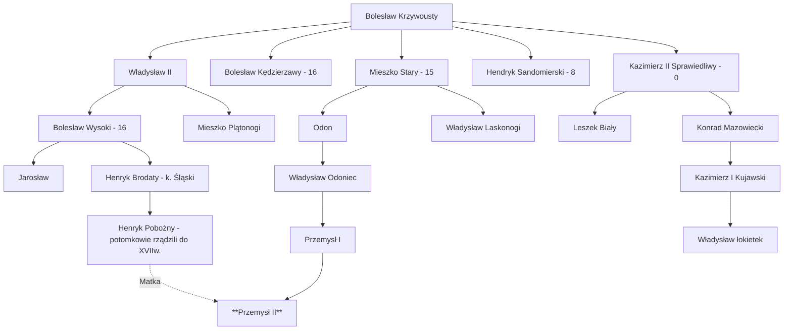
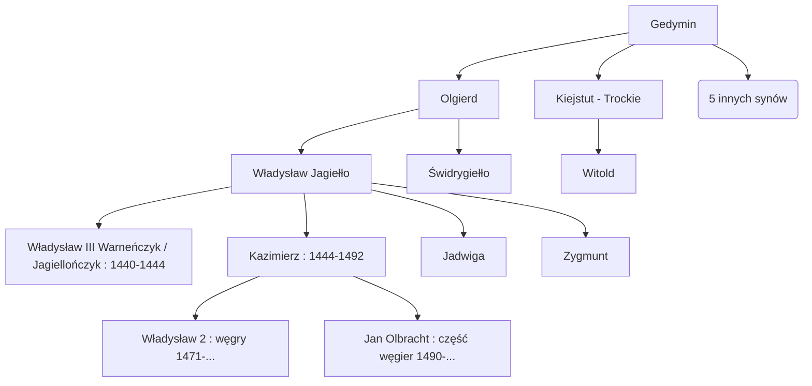

## Państwo Piastowe 960 - 1434
### Mieszko I ~960 - 992
Legenda przodków:
Piast Kołodziej -> Zimowit ... -> Mieszko I
Pierwszy książę państwa Piastowego - Mieszko I
Mocniejsza warstwa polan
* 963r. - wypowiada wojnę Wieletom. 
* 964r. Sojusz z królem czeskim Bolesławem Srogim (przypieczętowane maleństwem Mieszka z Dobrabą córką Bolesława)
* 14 kwietnia 966r. Chrzest Polski z rąk czeskich
* 989r. - zdobywa Śląsk i Małopolskę od Czech
* 992r. - Mieszko oddaje państwo w opiekę papieską. Od Gniezna do morza, Kraków itp.
* 992r. Mieszko -> Bolesław Chrobry

Mieszko chciał schrystianizować państwo. Dodatkowo margrabowie niemieccy by nie mieli powodu nas atakować.
Bieleci byli np ciągle atakowani bo prusacy.

XIII w. - koniec chrystianizacji Polski

Mieszko I - mocno umocnił państwo - kształt podobny do dzisiaj

### Bolesław Chrobry 992-1025
Wygnał macochę Odę. Chciał odbić Prusy. Wciągnął Wojciecha żeby głosił chrześcijaństwo w Prusach. Wykupił jego Ciało i chciał uzyskać arcybiskupstwo. Ponieważ Polska była pod arcybiskupstwem Niemieckim. Cesarz Otton III pomagał mu i uzyskał kanonizację.
* 999r. Kanonizacja Wojciecha
* 1000r. Zjazd Gnieździński. Dostaje diadem cesarski i kopie włóczni świętego Maurycego. 
* 1002-1018r. 16 letnia wojna - Bolesław uderzył na Niemcy i zdobył sporo Saksonii. 
* 1003 r. Na jeden rok przejął władzę w Czechach plus Słowację i Morawy.
* 1018r. Wyprawa na Kijów. Zamontował swojego protegowanego. 
* 1025r. Bolesław otrzymuje koronę królewska (bo Henryk II w Niemczech umarł)
* 1025 Bolesław Chrobry -> Mieszko II

### Mieszko II 1025-1034
* 1027r. Mieszanie się w politykę niemiecka - Konrad II (obecnie panujący) wyjeżdża do Rzymu... Atakuje saksonię. Wojna.
* 1030r. Konrad II używa braci Mieszka (Ottona i Bezpryma).  Bezprym był pretendentem do korony. Niemcy dogadują się z Rusią. Atakują z dwóch stron. Mieszko obrobił się, ale król Brzetysław (Czechy) zabrał Morawy. Stefan I (Węgry) zabiera nam Słowację. 
* 1031r. - pierwsze powstanie pogańskie przeciw Królowi i chrześcijaństwu
* 1032r. - Mieszko miał oddać koronę. Prawdopodobnie: Bezprym by miał większość kraju Otton mało i Mieszko mało. Bezprym wysłał Niemcom Poslkie insygnia koronacyjne.
* 1032r. - własni ludzie zabijają  Bezpryma - prawdopodobnie jego ludzie (bo okrutnie rządzi) - Mieszko odzyskuje władzę na całym okrojonym kraju.
* 1034r. Mieszko II -> Kazimierz I (Odnowiciel)
Dodatkowo pomorze się usamodzielnia.

### Kazimierz I Odnowiciel 1034-1058
* 1034r. Chcę wzmocnić władzę ale możni się buntują a Kazimierz ucieka na Węgry
* Masław / Mieścisław - książe rządzi mazowszem mimo Kazimierza
* 1038r. Brzetysław (Czechy) najeżdża Polskę i wiadomo wywozi dużo bogarsw i relikw z Wielkopolski
* 1040r. - dogasa reakcja pogańska, Kazimierz wraca z poparciem Henryka III z Niemiec (i paru jego zbrojnych). 
* 1050 odbicie śląsku czechom
* 1058r. Kazimierz I -> Bolesław Śmiały
Dlaczego Henryk III wspiera: BO bał się że Czechy są zbyt silne. Wierzę tylko ludy lubuskie. Przeniósł centrum państwa do Krakowa. Z Rusią odbija mazowsze 
#### Reformy
* "stolica" do Krakowa
* ZMIANA: Ziemia królów którzy rozdawali stanowiska i płacili za wojny -> członkowie armii sami się utrzymują  i dostają ziemię za walkę (**FEUDALIZM**)

### Bolesław śmiały 1058 - 1079
Wmieszał się w spór o inwestyturę po stronie papieża przeciwko [[2. Śred. Europa 500-1300#Henryk IV 1065 - 1105]].
* 1076r. Papież uznał że jest godzien i został koronowany na króla Polski.
* 1079r. Konflikt z biskupem Stanisławem - musiał uciekać
Powód konfliktu z Stanisławem (teorie):
A. Traktowanie żon rycerzy którzy wyszli na wojnę - zdradziły -  kara szczeniaki które gryzły im piersi (poniżenie) - Stanisław się stawił za nimi  a król go ukarał
B. Spór między bratem Władysławem - biskup Stanisław po stronie Władysława
Podsumowanie średniowiecza: **sojusze** w wojny a wojny w sojusze
### Władysław Herman 1079 - 1102
Władca kiepski. Lis dworski mógł nim kierować.
**Sieciach** - palatyn - mocno to wykorzystywał.
Pierwszy człowiek spoza dynastii który chciał przejąć władzę. Formalnie robił to Władysław ale tak na prawdę sieciech de facto rządził.

Bunt innych możnych - Władysław oddaje władzę synom. *Pierwsze rozbicie państwa*
Władysław - Mazowsze
Zbigniew  -  Wielkopolskę kujawy okolice
Bolesław - Śląsk Małopolska
Bolesław zabił Zbigniewa w 1107r. 
### Bolesław Krzywousty 1107 - 1138
Podbicie pomorza, chrystianizacja. Obrona przed najazdem 1109r.
TESTAMENT:
Podzielił cały kraj na pięć dzielnic, i najstarszy dzielnica senioralna.

### Okres rozbicia dzielnicowego - 1138 - (1306~1320). 
Czechy odbili Śląsk.
Pomorze zachodnie trafili do Brandenburgii.
Władcy zaczęli patrzeć na wschód nie zachód.

##### Podział:
Wielkopolska, Mazowsza, Śląsk, ziemia Sandomierska + Łęczycka, 
dzielnica  senioralna(Gdańsk -- Gniezno -- Kraków)
Senior dodatkowo otrzymywał lenno Pomorze zachodnie (Kołobrzeg - Szczecin - Rugia)

##### dzieci (lata w  1138r.)

* Władysław II (Wygnaniec) -  syn Bolesław wysoki (16) | kolejny Mieszko Plątonogi
* Bolesław Kędzierzawy (16)
* Mieszko stary (15) - Odon
* Henryk Sandomierski (8)
* Kaz

Władysław z pierwszego małżeństwa a reszta z małżeństwa z Salomeą
Testament : Władysław seniorem i będzie pomagał w rozwoju politycznym. Bardzo dużo interpretacji testament co może prowadzić do zamieszek.

#### Timbeline
* 1141r. Salomea - zjazd w Łęczycy za kogo wydać siostrę Agnieszkę. Wniosek: książę *Kijowski* Władysław : zaproponował księciu żeby zamiast tego swoją córkę z Bolesławem wysokim. Rodzeństwo wpada w wojnę. Książę ruski wysyła wojsko.
* 1144r. Umiera Salomea, ziemia Łęczycka powinna wrócić do senioralnej, ale jej synowie nie zgadzają, wojna, Władysław bierze do pomocy wojska ruskie. Musi oddać rusi wiznę.
* 1146r. Władysław chce wygnać brać. Przegrywa tę wojnę bo braci się zjednoczyli. Uciekła do Niemiec, princepsem jest Bolesław Kędzierzawy.
* 1157r. Polskę najeżdża cesarz Fryderyk Barbarossa (inspiracja władysława II wygnańca), Bolesław Kędzierzawy musi oddać hold lenny cesarzowi.
* ~ 1173r. Mieszko stary. 30 lat konfliktów o władzę
* 1177r. Bunt małopolski. 
* 1184r. Leszek Biały przejmuje władzę (20 lat) na zmianę z Mieszkiem Starym
* Leszek biały zjazd w Gąsawie aby koordynować wspólną politykę - Henryk brodaty
#### spór 1177r.
Strony:
- Możni małopolscy
- Odon (syn Mieszka Starego)
- Bolesław wysoki
VS
- Mieszko Stary
- Mięszko plątonogi (brat Bolesława wysokiego)
- Jarosław (syn Bolesława wysokiego)
- 

#### Zjazd w Gąsawie 1227
Uczestnicy:

- Konrad mazowiecki
- Leszek biały (princeps)
- Henryk Brodaty
- Władysław Laskonomi - 
Konflikty:
- Laskonomii -- W. Odoniec (książe w Nakle i Ujście - wielkopolska)

W. Odoniec ruszył z Branderburką jazdą na Gąsawe żeby wymordować wszystkich 
Jeźcy zaatakowali w nocy, większość przeżyła, Leszko Biały ucieka nago z łaźnii XDD i 2km od Gąsawy został zabity

**Skutki**
- Od tego momentu princeps nie ma władzy
- Chaos, większe rozbicie
- Dalej kuzyni się żenią i dalecy władcy mogą roszczyć o ziemie i więcej bójek
#### Timeline po 1227r.
- Kolonizacja Niemiecka - Śląsk, Pomorze - chcieli 
- Konrad Mazowiecki ściąga Krzyżaków żeby osiedlili się na ziemii Chełmińskiej - podbijają prusy.
##### Wyprawy krzyżowe w XIII w.
Papież stwierdził że wyprawy krzyżowe można odprawiać w Europie jeśli są poganie. Mogli prowadzić wyprawy krzyżowe przeciw Litwinom i Prusakom.
Dzięki temu że można było pokryć się chwałą na wyprawach krzyżowych, wiele polskich rycerzy udawało się na wyprawy krzyżowe przeciw Prusom.
Założyli wiele grodów które istnieją do dziś, nadbudowali zamków i mieli strong państwo, mieli handel bo byli w Hanzie - wspólny handel z Niemcami. Robi się z nich zagrożenie dla polaków.
Wielki miatrz krzyżacki - velman vol Salza.
Reszel, Malbork
ZAKON ISTNIEJE DO DZIŚ 

#### Najazd Mongolski - 1241r.
##### Chwila przerwy na Mongołów:
Wodza :  Ögedei Khan
W momencie najazdu przejęli praktycznie całą Azję i ruś, 

W czasie Kubilaj Khana:
1271r. - zdobywają Chiny i zakładają dynastię Yuan (trwa 90 lat)

Imperium szybko rozpada się na wiele mniejszych, m. Innymi złota orda (ziemie ruskie)
##### Najazd Mongolski 1241r.
Cel: zdobycie Węgier
Książęta śląscy współpracowali z Węgrami - 

Bitwa pod Legnicą - 1241r. 
Zginął Henryk Pobożny, ale niedługo potem zmarł Ogadej Khan więc Mongołowie przerwali podbój.

##### Rozbicie dzielnicowe c.d. 
Lokowanie miast na prawie makdeburskim
Przykład : 
1253r. - Lokacja Poznania na prawie magdeburskim- rynek + prostopadłe ulice

#### Przemysł II
- 1290r. Przemysł II zabiera insygnia królewskie
- 1295r. Konoruje się na króla Polski (władał wielkopolską i pomorzem gdańskim)
- 1295r. Zdrada (rogoźno) - Przemysł był zagrożeniem dla brandeburczyków - porwany i zmarł
Współpracował silnie z księciem Władysławem Łokietkiem. 
### Władysław Łokietek
Łokietek zaliczył szereg tytułów książecych ale zawsze wyganiany / obalany.
- 1300r. Władysław udaje się za granicę
- 1304r. Zostaje  księciem sandomierskim, dostaje kujawy, sieracko-łęczycki. 
- Chce przejąć władzę małopolski i Wacław II
- 1306r. - wojna domowa w Czechach. Władysław zebrał wojsko zdobył tam władzę. Po kilku latach zdobył władzę na wielkopolsce
- 1318r. Pismo do papieża o przywilej konoracji. Papież zgadza się pod warunkiem koronacji w krakowie(Król czeski Jan Lukseburski roszczył do korony Polski)
- 1320r. Konoracja władysława Łokietka
- Sąd Papieski - czy zabór pomorza przez krzyżaków zgodny z prawem. Sąd mówi że niezgodny, wyrok odwołali do papieża . Brak konsekwencji Krzyżaków
1330r - śmierć: Władysław Łokietek -> Kazimierz Wielki
### Kazimierz III Wielki 1330r. - 1367r.
Nie spłodził syna xD
10-letni kazimierz obserwował koronację ojca
23 letni dostał koronę

Małżeństwo z Aldoną Gedyminowiczną, potem Adelajda Heska (rodzina Wettów - August II i III Sas). Dwie córki

Bliski sojusz z Węgrami

Osiągnięcia:
- Jednoczenie monetarne - grosz krakowski
- Państwo którym władał znane jako korona królestwa Polskiego
- 750 tys mieszkańców - 1,8 mil
- Nadanie praw do lokacji 100 miast 50 zamków i otoczenie 30 miast murem obronnym
- Studium powszechne -> akademia Krakowska. Wydziały: nauk wyzwolonych, medycyny, prawa
- reforma prawa - statuty Wiślicko - Piotrkowskie (krok w stronę ujednolicenia )

#### Timeline
- 1338r. Układ z Bolesławem Jerzym 2 - przy bezpotomnej śmierci Bolesława Kazimierz przejmie władze w księstwie Halickim (stolica Lwów)
- 1343r. Pokój kalijski z krzyrzakami, Kujawy wracają do Polski
- 1345r. Śmierć Bolesława - hołdowanie ziemi halickiej (był w wojnie z Litwą)
- 1348r. Uznanie Słąska do Czech
- 1351r. Hołdowanie Mazowsza (przyłączenie do królestwa polskiego) 
- 1355r. Układ z królem Ludwikiem - w razie bezpotomnej śmierci Ludwik obejmie tron
- 1356r. Podbicie Podola (z twierdzą)
- 1367r. Śmierć -> Ludwik Węgierski

##### przykład prawa
- Prawo nie działa wstecz
- Prawo do obrony przed sądem (dla szlachciców)
- prawo do wschodu chłopów
##### Finanse
###### Reforma Monetarna
Czesi bili monety bo mieli złoża srebra.
Grozz Polski
Denary 1 grzywna - 768 denaròw

###### Źródła zysku
Żupy(kopalnie) solne - 1368r. - status żupny. Dochody z żup były przenaczane na akademię krakowską. 50 kg soli - 15 srebrnych groszy

Podatki Polarne - 12 grosze za 1 łan (17ha) szlachta; 24 grosze za 1 łan duchowieństwo

### Ludwik Węgierski 1367r. - 1386
Dynastia:  Andygawenów - poboczna gałąź Burbonów (Francuzi)
Born: 1326r
Start rządów Węgierskich: 1342r
Nie miał syna xD

Córki: Katarzyna, Maria, Jadwiga
Maria - król Węgier
###### Timeline:
- 1367r. Koronacja w Krakowie
- 1372r. Zrzekł się pretensji do Wrocławia i Śląska
- 1374r. Koszyce - w zamian za objęcie tronu przez córkę Katarzynę ulga podatkowa (12->2 gr)
- 1380r. Śmierć Łokietkówna - biskup i kontur i wojewóda ma wykonywać jego wolę
- 1381r. Rozszerzenie ulgi dla duchowieństwa (24->4)
- 1382r. Ludwig umiera, pusty kron krakowski
Gdy był w Budzie, rządziła jako regentka Elżbieta  - 
### Król Jadwiga 1386 - 1399
Miała być koronowana ale też miał być mąż - drugi król. Możni chcieli wybrać takiego którym mogliby łatwo manipulować. Wybór: książe Litewski jagiełło - fakt że go chrzcili osłabiaj jego pozycję.
Jagiełło zasiadał mając 48l. 
Jagiełło do 1401r. Większość czasu spędzał na Litwie - świeżo wyszła z wojny domowej. 

Ruś czerwona:
Spór między Litwą, Polską i Węgrami.
Ludwig wydał zarządzenie ze Ruś czerwoną włączy do Węgier. W zamian za Ruś czerwoną miała się zrzec tytułu dziedziczki korony węgierskiej.

* 1386r. Jadwiga (12) przyjeżdża do Krakowa na koronację 
* 1387r. Jadwiga wyrusza na wyprawę odebrać rusi czerwonej węgrom
* 8 marca 1387r. Wjazd do Lwowa - władza polska we Lwowie. Nadanie prawo składu (każdy przejeżdżający kupiec ma obowiązek sprzedawać ). 
* 26 września 1387r.  Petru Musza składa hołd Lenny Polsce 
* 1397r. Jadwiga spotyka się z wielkim mistrzem krzyżackim. W innowrocławiu domaga się ziemi dobrzyńskiej którą niedawno zgarnęli. Nie zgodzili się.
* 1399r. Córka elżbieta. obie szybko zmarły
 **KONIEC PANOWANIA PIASTÓW**
### Władysław Jagiełło 1399 - 1434
##### Kim on wgle jest
Urodzony: 1362/**1352**
Rodzina:

Gedymin: założył Wilno, podbił tereny od Litwy po morze czarne. Zostawił 7 synów i znowu podział na dzielnice.

Troki bardzo blisko Wilna i wsm Kiejstut i Olgierd współrządzili
Bracia rywalizowali. Kiejstut Troki i Żmudź Olgierd wilno i górna (południowa) litwa

##### Timeline
- 1377 - Olgierd -> Jagiełło
- 1378 - Jagiełło negocjuje pokój z Krzyżakami, i chce się ochrzcić
- 1380 - układ z zakonem inflackim (teren obecnej Łotwy) że nie pomoże Kiejstutowi przy ataku inflaków na Trockie
- 1381 - układ wychodzi na jaw, wojna domowa, Kiejstut przejmuje Wilno
- 1382 - Jagiełło przejmuje Trok. Wojska się spotkały i Kiejstut nie chce walczyć żeby nie tracić własnych ludzi. Kiejstut do lochu i umiera.
- 1385r. Jagiełło przyjmuje rękę króla Jadwigi. Unia w Krewi
- 1399r. Śmierć Jadwigi
- 1400 - dofinansowanie akademii krakowskiej (uni Jagielloński)
* 1401r. Jagiełło porozumiał się z bratankiem Witoldem Wielkim i dał mu tytuł wielkiego władcy Litewskiego . Skupił się na rządzenie Polską.
Ślub z księżniczką Anną która miała jakieś korzenie Piastowe. Jadwiga została wyznaczona na następcę ale się urodziło Jagielle synowie

##### Unia w Krewie
- Uwolnienie polskich Jeńców
- Chrystianizacja Litwy
- Jagiełło rządzi jako Król polski
- Własnym kosztem zrobi wszystko żeby odzyskać pomorze gdańskie i inne ziemie które zabrali Krzyżacy
- zobowiązanie Przyłączenia Litwy do Polski

##### Wielka wojna północna 1409r.
###### Powody
1. Zakon krzyżacki zabrał Pomorze (trzymał 100 lat)
2. Wywóz zboża przez Gdańsk w którym Krzyżacy pobierali podatki
3. Krzyżacy stali się silnym państwem groźnym dla Polski (szczególnie że mieli sojusz z zakonem kawalerów krzyżowych (obecna łotwa))
4. Zabrali Żmudź 
5. Krzyżacy nakładali duże podatki na mieszczan więc był duży sprzeciw mieszczan państwa krzyżackiego
###### Wojna
- 1409 - Jagiełło wysyła posłów do mistrza który był arogancki, posłowie zaczęli grozić on wziął jako wypowiedzenie wojny
- 14 sierpnia 1409 - krzyżacy wysyłają posłów **wypowiedzenie wojny** - *wojna z zaskoczenia*
- 15 lipca 1410
Krzyżacy zaczęli zdobywać północne miasta, ale w tym samym czasie wybuchło powstanie przeciw krzyżackie, wspierane przez wielkiego księcia Witolda.
- Jagiełło odbiła Bydgoszcz
Negocjację pokojowe przez jesień zimę wiosnę, lato bitwa wraca.
Jagiełło wysyła wojsko na Malbork i wielki mistrz wysyła wojska w odpowiedzi. **Bitwa pod grunwaldem**. 
###### bitwa pod Grunwaldem 1410
Jedna z największych biew średniowiecznej Europy.
Wojsk polsko litewskich ok 30 k (-2k)
Krzyżackiego 20k (-6k martwych reszta pojmana)
Rozstrzygnięta w 1 dzień.
Zginął wielki mistrz.
Strona Polsko-Litewska:
- Najwięcej Polaków, mniej Litwinów
- Mazowsze (lenno)
- Ks. Słupski
- Hospodar Mołdawii (500k)
- Paru tatarów
Strona krzyżacka:
- Książę szczeciński
- Książę Oleśnicki
- Biskupi pomezanii(ok. Ujścia Wisły), Chełmna, ...

###### Po bitwie
Po 2 miesiącach dochodzi pod Malbork, zaczyna oblegać Malbork (niemożliwe do oblężenia - oblężenie jest drogie - wojsko się nudzi, rabują, kiepskie warunki w obozach tworzą epidemie). 
Odpuszcza oblężenie. 

- 1 luty 1411 roku pokój toruński - Krzyżacy oddają wiele ziem, wolny handel
- Wpłacenie 6 milionów groszy za jeńców; 2 miliony 220 tys pożyczki dla Niemców

**Wielkie zwycięstwo militarne, polityczna porażka**
- 1413 rok pokój z Krzyżakami
##### 1413 Unia w Horodle
- Potwierdzenie przeszłych porozumień
- oba kraje uznają bojarów litewskich równych szlachcie Polski
- Odrębność Litwy jako bytu politycznego
-  Paniom Litewskim elekcja kolejnego księcia litewskiego
- Administracja litewska na wzór Polski
- Oba państwa mają prowadzić wspólną politykę zagraniczną 
##### Dodatkowe przywileje aby zapewnić następstwo tronu
- Czerwiński - panowie szlachta mają ochronę przed konfiskatą majątku bez wyroku sądu
- 1430 Jedliński - szlachcic nie może być aresztowany bez wyroku sądu
- 1430 Jedliński Wszystkie urzędy kościelne obstawiane szlachtą

##### 1430-1435 - wojna Liwy i Krzyżaków przeciw Polsce
- Twój dziedziczy Świdrygiełło
- 1432 - obalenie Świdrygiełła przez Zygmunta
- 1434 - Władysław Jagiełło umiera
- 1435 pokój,  zakon krzyżacki nie będzie szukać poparcia ni pośrednictwa w kontaktach z Polską u papieża ni cesarza

###  Władysław Jagiellończyk 1434 - 1443
W 1434 ma tylko 10 lat, jest tylko koronowany.
W jego imieniu rządzi Zbigniew Oleśnicki, biskup krakowski, oraz królowa Zofia Holszańska (rywalizują ze sobą).
Król przejmuje władzę w 1440 (16 lat) zostaje wybrany przez sejm węgierski na nowego króla Węgier. Czemu? Turcy zaczęli zagrażać Węgrom.

Turcy nie zdobyli jeszcze Bizancjum podbili Serbię Bułgarię kawałki greccy.
##### Timeline
- 1440 - mianowany Królem Węgier
- 1440 - śmierć Zygmunta
- 1443 rok wojna z Turkami
	- 1 grudnia 1443 zdobycie Sofii (pali)
	- 12 czerwca 1444 Pokój z Turkami (na 10 lat)
	- Delegat papieski namawia Władysława żeby kontynuował wojnę z Turcją
	- Sierpień kontynuuje pozbywanie Bułgarii (w blisko Edirna)
	- floty nie przybywają na pomoc
	- Turcy odcinają drogę powrotną do Węgier, bitwa pod Warną
	- **śmierć króla Władysława**
### Kazimierz I / Kazimierz IV Jagiellończyk 1443 - 1492
Wiele stanowisk obstawianych przez **Radziwiłłów** i inne rodziny
Młody władca na początek się uczy polityki i inni za niego rządzą ale szybko się usamodzielnia
##### Timeline
- 1444 - Mazowsze rości prawa do ziemii która należała do Litwy
- 1444 - Władysław płaci żeby Mazowsze nie miało roszczeń
- 1445 - zajazd w sieradzu (szlachta polska proponowała mu koronę ale musiałby dać szereg przywilejów dla szlachty)
- 1446 - porozumienie, Polska i Litwa unia personalna, dwa osobne byty
- 1492 - śmierć Kazimierza IV Jagiellończyka

Kazimierz wspierał średnia szlachtę przeciwko magnaterii w Litwie.

###### Spór papieży:
Mikołaj 5 papież i Feliks 5 antypapież 

Kazimierz popierał Mikołaja, a za to domagał się 
przywileju mianowania biskupów i innych dostojników królewski. 

Mikołaj domagał się z biskupem Oleśnickim i chciał zakazać Kazimierzowi.
##### Wojna trzynastoletnie
###### Związek Jaszczurczy
1397 rok, szlachta państwa krzyżackiego, miała chronić cywilów wobec władzy zakonnej
###### związek pruski
1440 rok, zbierał miasta Pruskie które nie chciały być częściami państwa Pruskiego.
Bajka: czuli się Polakami
Prawdopodobna Rzeczywistość: Prusy miały bardzo wysokie podatki

- 6 lutego 1454 związek pruski wznieca powstanie antykrzyżackie
- 6 marca 1454 - związek pruski prosi o wyłączenie poród do królestwa polskiego.
- Kilka miesięcy Polska armia przejmuje większość terytoriów
- 11 grudnia 1454 - bunt szlachecki, chcą więcej przywilejów ( zabezpieczenie interesów itp )
- 1457 rok - zdobycie Malborka (przekupienie załogi Malborku). Malbork nienaruszony znalazł się po stronie polskiej
- 1462 - bitwa pod Świeciem
- 1466 - upadek ostatniej twierdzy krzyżackiej
###### II pokój toruński 
Państwo krzyżackie podzielone na 2 części
Prusy królewskie - włączone do korony polskiej
Prusy Książęce - Lenno królestwa polskiego ()

Kazimierz Jagiellończyk nie niszczył zakonu bo miał dzięki Lennu większy hajs.
Oczywiście potem ta część prus się zjednoczyła z Brandenburgia i zaczęła zagrażać Polsce

##### Następcy
Ożenił się z Elżbietą Rakuszanka (Rakus - Niemiec).
13 dzieci, 6 synów, 4 królów
1 syn Władysław II Jagiellończyk- Król Węgier (i Czech i Chorowacji)

##### Fun fact:
Crimen Solicinacjolis - przęstepstwo kiedy duchowny domaga się korzyści najczęściej seksualnych : 1922r. - rozkaz papieski o to jak to traktować