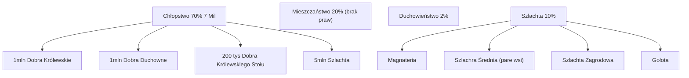

## Silnawa Polska 1492 - 1700

### Władysław II Jagiellończyk
1471 - Królem Czech Władysław Jagiellończyk (najstarszy syn Kazimierza Jagiellończyka)
1490 - Węgry szukają nowego króla, wybierają Jan Olbrachta

Węgierscy magnaci chcieli Władysława Jagiellończyka i wybuchła wojna.
Bitwa pod koszycami - Jan 8K Władysław 18k.
Pokój - Władysław dał Janowi parę ziemi czeskich w zamian oddając pretensje do tronu węgierskiego. Ale tuż potem zebrał znowu armię, trochę potyczek ale doszli do ładu 1491

### Jan Olbracht 1492 - 1501
##### Głosowanie
**Pretendenci:**
Jan, władysław, Zygmunt Jagiellonowie , Janusz II (Mazowsze)

Jan odziedzicza Jan Olbracht.
Aleksander - wielki Książe litewski

Jan potwierdza wszystkie przywileje szlacheckie 1493. Pierwszy kiedy Senat + Sejm (szlachta wybrana z sejmików).

#### 1494 przywilej piotrkowski
Raz na rok 1 chłop mógł opuścić ziemię szlachcica
Mieszczanie zakaz otrzymywania ziemi i posiadania stanowisk

1495 - mazowsze dołączone do polski bo Janusz II umiera
1497 - wyprawa na Mołdawię (Stefan IIi Wielki akurat rządzi)
"Za króla Olbrachta wyginęła szlachta"

- 1501 - wyprawa króla Jana na Malbork (ale zmarł na Syfilis) 

### Aleksander Jagiellończyk 1501 - 1506
Mało pretendentów -Janusz II umarł a Władysław był stary i nie chciał
Połączył władzę litewską i Polską. Włożył mu koronę na głowę  prymas Fryderyk Jagiellończyk xD.

##### Unia mielnicka - 
Twój wielkiego księcia litewskiego wybierany
Oba państwa łączą się w jedno ciało nierozdzielany.
Wzajemna pomoc wojskowa, wspólna monet, itd. 

DLACZEGO: Litwini potrzebowali sojusznika w walce z Moskwą.

##### Skutki wojny 1503
30% zuemii litewskich -> moskwa
1506r. - śmierc

### Zygmunt stary  (Jagiellon) 1506 - 1548 ...
Jedna elekcja, bardzo słabiutki głos litewski
Ukoronował się na obu tronach.

##### Druga wojna z Moskwą 1512 - 1522

##### Zjazd w Wiedniu 1515
Zygmunt Stary, Władysław II Jagiellończyk, Maksymilian Habsburg

Gdy wygaśnie dynastii Jagiellonów na tronie czeskim to Habsburgowie przejmą.

Problem : Król Ludwik (syn Władysława II) umarł w 1526 bezpotomnie.
Był tragicznym królem. 

##### Potomstwo:
Zygmunt August jedyny prawowity następca
Gdy miał 9 lat był koronowany **Vivente Rege**.

1525 - przyjęcie hołdu pruskiego przez Zygmunta
1529r. - mazowsze trafia do Rzeczypospolitej

##### Hołd pruski
Luter namówił wielkiego księcia krzyrzackiego zżeby olał papieża i przezedł na Luteranizm.
Hołd - państwo krzyżackie staje się normalnym księstwem, Albert Hohenzolen stawał się księciem (dziedzicznym). 

Zagrożenie Krzyżackie wydawało się być zneutralizowane.

Zygmunt Stary - Ściągnął pyry (ziemniaki) z amerykański do polski

### Zygmunt August (last Jagiellon) 1548 - 1572
3 żony: Dwie Harbzburżanki, Barbara Radziwiłowna. 0 potomstwa. **Duży problem**

#### Wojna o inflanty 1558 -1582
Pre-lore:
Zakon kawalerów mieczowych(łotwa/estonia) też zamienia się w świeckie państwo. Układ z Z Augustem: część państwa do Polski a reszta lennem polskiego.

##### Strony
Iwan IV groźny - car Moskiewski
Moskwa --- Litwa()

#### Unia Lubelska 28 czerwca 1569
Powód : bardzo duże osłabienie spowodowane wojną z Moskwą, przez co potrzeba było się zjednoczyć. Był to pomysł magnaterii koronnej 
Połączenie obu krajów. 28 czerwiec 1569
##### postanowienia
Połowa wielkiego księstwa (Ukraina)  trafia Ukraina, Podlasie.
Podział: korona ma 2 prowincje (wielkopolska i małopolska)
Litwa : 8 województw 
1 państwo 1 król 1 skarb. Rozdwojone urzędy (np. Matszałkowie)
**Zdominowanie sojuszu przez Polskę**

##### 1560 - pierwszy Polski okręt wojenny "Smok"
Zygmunt Stary już chciał bo był w konflikcie z Gdańskiem, który kontrolował Wybrzeże. Zygmunt Stary wspierał Elbląg.
##### 1562 Wydanie siostry Katarzyny za szweckiego Jana Wazę
Urodził się syn Zygmunt Waza

##### ŚMIERĆ BEZPOTOMNA

### USTRÓJ: Demokracja szlachecka 
Bardzo demokratyczna- 10% ludzi miało prawo głosu (300 ludzi później  Anglia, Francja 4%)

##### przywilej koszycki 1374
OGROMNA ULGA PODATKOWA (12-> 2 i 24-> 4)
Zwolnienie z wszystkich świadczeń oprócz 
**TOLINK**
##### 1422 przywilej Czerwiński - Władysław Jagiełło
Nietykalność majątkowa.
**TOLINK**
##### 1454 przywilej mieszawski
Niemożność zwoływania pospolitego ruszenia ani nakładać podatki bez zgody szlachty.

##### 1493-1496
Właściciele ziemskie, urzędnicy, wyższe urzędy kapłań

##### 1505 Konstytucja Nihili Novi 
Król nie może uchwalać praw bez zgody szlachty

#### trójpodział władzy
Wykonawcza: Urzędnicy (centralni: kanclerzowie, marszałkowie (zdublowani na Polske i Litwe)). Wojewodowie, Kasztelanowie - ich władza była różna w zależności od tego kto posiadał ziemię
Ustawodawcza : 
- Sejm (izba poselska (120-180)). Sejmiki ziemskie -reprezentaci -> sejm walny 
- senat(mianowani przez króla senatorzy. Z urzędu zasiadały najwyższe ))
- Król
Sądownicza: Sędziowie tylko dla szlachty. Oczywiście że sądy też obstawiane przez szlachtę 

Średnio przez 300 lat było 240

Senat - polityka międzynarodowa
Izba poselska - ustalanie podatki, nadawanie szlachectwa

W Izbie Poselskiej utrwaliło się jednoczesne podejmowanie głosu. Liberum Veto. 

Za czasów saskich zrywano 80-90% Sejmów. Wchodzi anarchia magnatów.  

Sejm Konwokacyjny:
Prezentacja kandydatów na królów
Sejm elekcyjny:
Wybór króla
W międzyczasie interrex.

#### Teologia - Sarmaci
Szlachcice pochodzą od Sarmatów, którzy byli "lepsi". Na tej samej logice działała kolonizacja.
Obudowywali w Męstwo Honor itd a było trochę lepiej trochę gorzej.

Duży potencjał szlachciców do wojska ALe nikomu nie chciało się.

Po pewnym czasie szlachta stwierdziła że wsm nie musi.

#### podział etniczny
- 40% Polacy
- 40% Rusini
- 10% Litwini
- 10% Niemcy i Żydzi

#### Sejm 
7 lipca 1572 - śmierć Zygmunta Augusta 
1 listopada - senat proponuję wybrać posłów na sejm konwokacyjny
Styczeń 1573 - sejm konwokacyjny. 
Maj - sejm elekcyjny
Luty 1574 rok - Henryk Walezy koronowany
1 maja 1576 - wybór Stefana Batorego
##### Sejm konwokacyjny
**Postanowienia:**
Konfederacja- nie można wetować decyzji bo podejmowane większością głosów
Nałożenie podatków na siebie
Konfederacja Warszawska - swoboda wyznania
Interrex - arcybiskup gnieździński

##### Sejm Elekcyjny - 11 maj 1573, Praga Warszawska 
**Ernest Habsburg**
**Henryk Walezy** - brat króla Francji
**Iwan Groźny** - dobry sojusznik żeby RP nie toczyła wojen z Rosją
**Jan III Waza** - Król szwedzki, mąż Katarzyny Jagiellonki

Wybrany: Henryk Walezy; Logika: żeby mieć sojusz z Francją i zdjąć razem cesarstwo Niemieckie

Kwiecień - w pradze 
### Henryk Walezy 1572-1574
Król wybrany w 1572
##### Artykuły Henrykowskie
- Zachowanie przywilejów szlachty
- Raz na dwa lata musi zwołać sejm
- 16 senatorów - wszystkie ważne decyzje musi za ish radą i przyzwoleniem
- Uszanowanie swobody wyznania
- Gdy król złamie to szlachta może zrobić rokosz
##### Pacta Conventa
Spłacić długi, dużo kasy na akademię krakowską, ściągnąć dużo floty itp...

18/19 czerwca ucieka z Wawelu bo tron Francuski się zwolnił.

#### Jan Zamojski
Ze wszystkich miast 200tys rocznego dochodu (skala: S. Batory potrzebował 300 tys)
Kazał zbudować Zamość
Hetman koronny, kanclerz RP. (Wojskowe i wdministracyjne)
17,5 tys km (ok Woj. Pomorskie)
Zdobył Mołdawię i Wołoszczyznę od Turków ale musiał wrócić do RP bo atak szwedów w 1605

### Stefan Batory 1574 - 1578
Source : książę Siedmiogrodu
Wpadał Siedmiogrodem gdy podbiły Turki

Stary, doświadczony polityczny

1 maj 1576 - koronacja. Karta od Turków: większy haracz na Siedmiogród
Ożenił Anne Jagiellonkę

##### Wojna z Gdańskiem
Mieszczanie gdańscy popierali Maksymiliana Habsburga (król Niemiecki, Węgierskim Czeskim). Wnuk Władysława Jagiellończyka.

Początkowo wojna celna (wysyłanie zboża przez Elbląg)

##### Piechota wybraniecka
Na 20 łanów trzeba wystawić 1 chłopa.
Szlachta się zgodziła zrobić to tylko na królewszczyznach. Też nie podobało ale szlachcie (żeby król nie miał armii). 2k z korony 

#### Wojna z Moskwą
###### podatek specjalny 1578
Podatek specjalny na wojnę za przywilej oddania władzy sądowniczej szlachcie (trybunał koronny).

##### wojna
Zdobyli Połoc(Północno-wschodnia Białoruś), pojechał oblegac Pskov. Iwan IV rokował.
##### Skutki:
Całe Inflanty które Rosja zabrała RP wraca
Ziemia Płocka wraca do RP
10 lat rozejmu
**Śmierć w 1578**
### Zygmunt Waza 1587 - 1632

Zdolny ale dużo wad.  Był zbyt zainteresowany Szwecką Koroną.
Syn Katarzyny Jagiellonki, syn Jana III Wazy.
#### dojście do władzy
Na poprzedniej elekcji, jednym z pretendendów był Jan III WAZA. Miał za żonę Katarzynę Jagiellonki.

Dlaczego głosowli na niego: dałoby to sojusz personalny z potężną Szwexją.

Po śmierci Batorego startuje do elekcji jako pół Jagiellon

**Problem:** był drugi, spory obóz który popierał maksymiliana Habsburga
Obaj byli poinformowali że zostali wybrani na polskich królów.

 ##### Krótka wojenka.
 
Zamojski zorganizował wojska i pokonał wojska M. Habsburga więc koronowali Zygmunta Wazę

Doszło nawet do oblężenia Krakowa przez wojska Habsbutga xD
Fun fact: Większość głosujących była z Polski a nie Litwy.

#### Timeline
- 1592 - Zygmunt zostaje królem Szweckim bo papa umiera
- 1596 unia brzeska 
- 1596 przeniesienie stolicy do Warszawy (dalej formalnie w Krakowie). 
- 1600 przyłączenie Estonii
- 1601 wojna o Estonię
#### 1592 wojna domowa w Szwecji o koronę
Wojna domowa w szwecji
Królem Szwecji zostaje Karol Waza.  Szlachta zaproponowała że syn Zygmunta może być wychowany na protestantyzm i wtedy będzie rządził. Nie zgodził się

Za to w Polsce:
Zygmunt przepycha pomysł żeby była Unia z kościołem prawosławnym.
##### 1596 Unia Brzeska - kościół unicki
Wszyscy prawosławni **mogli** przejść pod zwierzchnictwo papieża, zostawiając obrządki.

Czemu: żeby Patriarcha Rosji nie rościł zwierzchnictwa nad wiernymi protestantami w Polsce.

#### 1600 Jan Zamojski wyprawia się na mołdawię
W tym samym roku książę Michał Waleczny zjednoczył całą Rumunię.
Zamosjki wjeżdża i go spycha.

#### Konflikty ze Szwecją 1601-1629
Zygmunt i jego synowie koronowali się królami Szwecji -> dobra wymówka na wojnę

#### Rosja w tym czasie
Umiera Fiodor Car Rosji. Zaczyna się czas c wielkiej smuty w Rosji. 
Dymitrjady:
Syn Dymitr tajemniczo zginął. Nikt nie wierzył wsm że rzeczywiście zniknął.

Władze obejmuje Borys Godunow. Rządzi krótko bo przybywa Dymitr Samozwaniec. 
Książe Wiśniowiecki się z nim dogadał. Dał mu trochę wojska, a ten zdobył tron.
Obalony przez Wasyla Szustiego.

Drugi Dymitr u księcia Adama Wiśniewieckiego.
Wojsko Koronne zdobywa Moskwę.
Bojarzy (szlachta rosyjska) chcą osadzić Władysława syna Zygmunta **pod warunkiem nawrócenia na protestantyzm**. Brak zgody. 
- 4 listopada 1606 załoga Polska przepędzona z Kremla 
- Michaił Romanow (300 lat )
4 listopada - dzień jedności narodowej.

#### 1606 - Rokosz Zebrzydowskiego 
Argument: Zygmunt próbował na wzór Szwecji wzmocnić władzę królewską i osłabić rolę szlachty.
Wojska królewskie wygrały, ale Zygmunt porzucił pomysł - brak zmian w systemie.

### Władysław IV Waza 1632 - 1648
Bardzo chorowity na tronie. Szlachta była praktycznie zgodna żeby go posadzić.
Kolejna wygrana wojna z rosją.
#### pokój w polanowie 14 cze 1634
Koniec wojny smoleńskiej. Przyłączone wschodnie rubieże wokół Smoleńska. (Druga wojna która chciał car rosji odbić to co Zygmunt zabrał )

#### Zmiany 
- kazał założyć fort Władysławów i fort Kazimierzowski - rozbudowa floty

### Jan Kazimierz Waza1648 - 1668
Brat Władysława Wazy
##### pre king lore
Dużo podróżował. 
1638 - propozycja wice- króla Portugalii (pod Hiszpanią)
W drodze do Francji aresztował go kardynał Richelieu. Po 1 roku Jan Kazimierz wrócił do RP bo Hiszpania i Portugalia nie były już w sojuszu

1643 - wstąpią do zakonu Jezuitów w 

#### Powstanie Chmielni kiego
Pochodził z kijowszczyzny. 3 powstanie kozackie
##### Powody powstań kozackich
Województwo kijowskie - największe województwo. Rzadka gęstość zaludnienia. 
Były tak zwane dzikie pola - za bardzo państwo nie funkcjonowało.  osiedlali się ludzie którzy pouciekali od swoich panów.
**Do tego momentu deal:**
Swoboda Kozaków będzie szanowana za bronienie granic przed najazdów tatarskim.

**Jednakże szlachta zaczęła kolonizować:**
Jednakże wojewoda Kijowski ( Wiśniowieccy) zaczął sprowadzać tam osadników żeby gospodarować ziemie, co się im nie spodobało - to miała być ich ziemia

Dodatkowo, wojsko kozackie dążyło do statusu wojska rejestrowego (żeby otrzymywać żołd). 

Chmielnicki Walczył o zwiększenie praw Rusinów - 40% ludności bez żadnych praw.
Szlachta nie chciała negocjować. Księża nie byli zainteresowani żeby chłopstwo miało prawa. 
Zgodzili  Wpisanie do wojska rejestrowego - zwiększenie podatku. 
##### Przebieg
Kozacy wygrali kilka bitew.  Król Kazimierz musiał się przyłoczyć i więcej wojsk dać. Zdobył zbaraż, bitwa pod zborowem
##### Ugoda
Miał powstać Hetmanat. Rządził Hetman kozacki, zwiększono limit wojsk rejestrowych. Więcej praw.

Jednakże ani król ani szlachta nie wywiązuje się.

##### 1654 Chmielnicki oddaje kozaków w ochronę Rosji - Do wojny włącza się Rosja
Dosyć słaba decyzja bo władza w Rosji bardzo absolutna. 

Rosja zaczęła się angażować, były bitwy z Rosją, się robiło bardzo gorąco... ALE gdy Szwecja zaatakowała, Rosja wstrzymuje działania wojenne żeby nie pomagać Szwedom.

#### Potop Szwedki 1655 - 1658
##### przyczyny
Znacznie spadły temperatury. Nawet w środku zimy między Gdańskiem a szwecją "była karczma na lodzie" - droga ... lądowa?

Znacznie mniejszy urodzaj w Szwecji - musieli zająć się grabieżą żeby się wykarmić.

##### przebieg
Szwecja - Polska
Ludność:
2,5mln l -  17 mln 
Armia I faza:
25tys - 13tys + 1tys (wybraniecka)

Szwecja kontrolowała Pomorze zachodnie. Przeszli z pomorza do wielkopolski. 
W pobliżu Noteci granica.

Szlachcicom nie zależało na walce bo "ten szwed tamten szwed".
Np. Bogusław Leszczyński miał dowodzić ale uciekł do Wrocławia.

Karol Gustaw wjeżdża z +12 k
Konin -> Koło -Warta> Warszawa

Król Jan Kazimierz zebrał część armii i po paru porażkach uciekł na śląsk.

Za wojskiem liniowym szło wojsko kwatermistrzowskie. Regularna kradzież wszystkiego. (Niczym rusaki)

Król Kazimierz nawet chciał oddać Maksymilianowi Habsburgowi koronę żeby on odbił.

Po pół roku przekroczył granicę w stronę Lwowa.
Pierwsze zawierzenie RP matce boskiej (1 kwietnia).
Przysięgał nawet że poprawi sytuację chłopów i mieszczan.

Jan Kazimierz zaczął organizować opór.

Wklepali 
##### Traktat w Ranot
Między Szwecja i Siedmiogród.
Szwecja bierze większość RP, małopolska do Siedmiogrodu, Branderburgię do Wielkopolski.

Jan Kazimierz:
##### Traktaty Wierasko - Bydgoskie
W razie wygaśnięcia dynastii Pruskich to przejdą one pod władzę księcia Branderburgii.

Siedmiogrodzie wklepały wojska które ogarniały Kozaków.

Ostatecznie po 5 latach

###### o co chodzi ze sceną z potopu
Książę Bogusław Radziwiłł i Janusz Radziwiłł oddają Litwę Szwecji.
Mieli oni zostać wielkimi książętami Litewskimi a niech Koronę se podbija 

##### pokój w Oliwie 1658
Po 5 latach koniec.
Dużo wygrabili
##### wojna z Rosją
Oddali całą lewobrzeżną(per Dniepr) ukrainę z Kijowem 

##### nowe wymagania kozaków - Unia Hadziacka
Rzeczpospolita trzech narodów.  
Gdyby 

Hetman szybko został obalony przez Jerzego Chmielnickiego i szybko trafili pod obcas carski

###  Michał Korybut Wiśniowiecki 1669 - 1673
Przez te wszystkie wojny , Potop powstania ,  Abdykował Jan Kazimierz
#### elekcja
Stronnictwa:
 ##### Pro-Francuskie - książe Ludwik Burbon
 Francuska rodzina królewska.
 Argumenty: Gdy zostanie dowódca będzie super.
 Nazwa: Malkontenci . Na czele stał Jan Sobieski.
 
 ##### Król piast - Michał wiśniiowiecki
 Dużo było w tym interesów szlachty
 Syn Jeremiego Wiśniowieckiego, sławnego dowódcy i potężnego magnaty
 Żona: Eleorona Habsburg
 Dużo przebywał na dworze Jana Kazimierza
 Studiował na uniwersytecie w Pradze (znał bardzo dużo języków )

Władzę obejmuje Michał Wiśniowiecki
#### Władza
**Szykowała się wojna z Turcją**
Malkontenci razem z Sobieskim się zebrali żeby wdrożyć jak najwyższe podatki żeby opłacić wojnę z turcją.
Regaliści oczywiście się nie zgodzili.

##### wojna. Z turcją 1672 lipiec
Nie zostały zebrane podatki na wojnę z Turcją. 
W 1672 Turcją przekracza granicę

Michał Wiśniowiecki zebrał kogo się dało i poszedł

Oblężenie Kamieńca Podolskiego
Oblężenie Lwowa - Lwowcy się zrzucili na okup więc turcy skipni Lwów.
Doszli do Chrubieszowa, Gołąb

Konfederacja Gołąbska do obrony. Król proponuje zmienić ustrój : Kadencyjnojść urzędów, zakaz posiadania kilku urzędów naraz (wymierzone w magnatów). Osobny postulat Sobieski no longer hetman. Regulacja zasad pospolitego ruszenia.

W tym samym czasie Jan Sobieski też ich tłukł.
Dominuje wyprawa na czambuły, spektakularne zwycięstwa. L

10 listopada pokój w Buczaczu Turków
RP zrzeka się podola, Bracławzczyzny, Polacy Turcji Haracz - CAŁKOWITA PORAŻKA mimo że mogliśmy się bronić. SEJM ZOSTAJE ZERWANY.

FINALLY zbiera podatki i wojska
8 października - 40k 
Zatruł się i umarł

Jan Sobieski poważnie potłukł turka. Część szlachty pojechała grabić ziemię Sobieskich i jej okolice. 

II. Anonimowy poeta
"To był mój żywot. 
Więcej nie znałem. 
Nie wiem czym królem. 
Wiem żem Michałem" 
XDD GET ROASTED

### Jan III Sobieski 1674 - 1696
##### pre-king lore
Żona : Marysieńka. Poznał 1655, dama dworu królowej francuskiej. Zakochali się. Marysieńka została ożeniona z Janem Zamojskim. Tydzień po jego śmierci ożeniła się z nim. 

Lew Lechiatanu.
Syn bogatego szlachcica. Wysłany do akademii krakowskiej. 
Łacina, francuski, niemiecki, tatarski, hiszpański 

Grand tour: przejechał się popoznawać innych szlachciców.

Starosta Jaworowski. 

Przez pół roku zaprzysiężył lojalność królowi Karolowi Guatawowi

Następnie gdy król Jan Kazimierz wrócił to pojechał na południe RP na granicę z siedmiogrodem (walczył z Jerzym Akoczym). Dobrze się spisał.

1666 - zostaje marszałkiem wielkim koronnym
1667 - bitwa pod Podhajcami, 
1668 - tytuł hetmana koronnego
1668 - zrywają sejm przez liberum veto wyboru króla - potężny skandal
Wyprawa na czambuły tatarskie (3k jazdy -> 30k)
Rozbił armię które atakowały czambuły i rozbija 30k i odbija 40k jeńców. Ogromna Sława
1663 - dowodzenie pod II bitwa chocińską

Michał Korybut - dzień przed bitwą chocimska umiera. 

1676 - wojna się uspokaja. 

#### Rządy 
Chciał działać z Francją ale nie chcieli. Wchodzi w sojusz z Rosją przeciwko Turcji

##### Pokój Grzymułtowskiego 6 maja 1686 (z Rosją )
Bardzo niekorzystne warunki dla Polski. 
Potwierdzanie warunków sojuszu Andruszowie 1667.
A. Lewobrzeżna Ukraina do Rosji
B. Wszyscy prawosławni w Polsce pod opieką rosyjską. - pretekst to wojen i interwencji

##### Wojna z Turcją 
Nie znalazł sojuszników do wojny z Szwecją i Branderburgią. Żadne się nie udało bo słaba RP.

Mocno wklepywał turcją.

##### Wiktoria Wiedeńska 12 września 1683
Dostanie z Austrią - królem Leopoldem I Habsburgiem.
W przypadku ataku na jednego drugi pomoże.
Na wieść o oblężeniu król poszedł pomóc. 
Armie się połączyły. Pilskie wojska 1/3 armii. Pod komendą Jana Sobieskiego

Święta Liga - Turcy
90k - 130-300k
Taktyka: Bombard, ostrzał artyleryjski a potem kawaleria.

Po 12 h bombardowania wysunęli 20k jeźdźców, największą jazdę konnicy.

Sam wielki Wezyr i Mehmed IV uciekali.
Legenda głosi że ukradli wtedy mnóstwo kawy.

Przed powrotem gonił Turków. 
Bitwa pod parkanami( Szturowem). Około -10k Turków

##### Pokój w Karłowicach
1. Odzyskanie ziemi na rzecz Turcji
2. Zrzucenie Lenna

Mniej więcej koniec wojen z Turcją

##### Reformy w RP
###### Reforma armia. 
Zmiana piki na berdysze.
Rozpowszechnił broń palną.
Wprowadzenie dragonów na szeroką skałe
###### Inne
Dużo pieniędzy na mecenat kultury.
Wykształcenie, sztuka i nauka.

Szlachcie się nie podobało oczywiście na to co król robił.

**Rząd króla Jana to rozkład państwa, demokracja -> anarchia**. Wszyscy szlachcice się 

Opina:
RP by się sypała już za króla Jana, ale on był zdolnym politkiem.

Nie udało się osadzić syna przez Vivente Rege bo liberum Veto.
## Okres Królów Saskich 1696 - 1763
#### Podsumowanie:
Rządy Augusta II, Augusta III, Stanisława Leszczyńskiego
Upadek RP, wzrost znaczenia magnaterii która służyła interesom innych państw.

Przez 70 lat armię obce chodziły po RP 
Ogromne spustoszenie kraju, głód bieda.
Ludność z 11 do 6 mln (głównie z głodu, na zarazy).
Niemal non stop wpjny. 
Ściągano osadników z Niemiec, Holenderskich (na równiach wokół Malborka na przykład).

**Polska nierządem stoi**
**Za króla Sasa jedz pij popuszczaj pasa**
**Od Sasa do Lasa**

Każdy Król był wybierany dlatego bo popierało go silne stronnictwo zagraniczne. 
RP była utrzymywana przez ościenne państwa bo była idealnā strefa buforowa między wschodem i zachodem i południem
### August II Mocny (Saska dynasja Wettynów) 1694 - . - 1733
#### Elekcja
Dynastia panująca w Saksonii.
Boczna odnogą jest Saksebogyrbota -> Windsonowie (Wielka Brytania, Belgia, Bułgaria)

Kandydaci
* książę francuski ludwik de Konti
* August Ii Mocny
W głosowaniu wygrał francuski.
ALE Augusta przybył pierwszy do Krakowa i koronował się pierwszy. Wybuchła krótka wojenka i nic się nie stało.

Był człowiekiem całkiem niezłym, szczególnie że był wykształcony i mógł prowadzić do unii z Saksonią.

Jednakże w Saksonii było zupełnie inaczej bo tam był władcą absolutnym.
Saksonia -  Rzeczpospolita
Mała - duża
Gęsto zaludniona - rzadko zaludniona
Przemyśl - stare rolnictwo
Równowaga ze wskazaniem na  Mieszczaństwo -  szlachta
Protestantyzm - Katolicyzm

Nawrócił się.

#### rządy
Jest mało zainteresowany rządem w Rzeczypospolitej. Większość czasu spędzał w Saksonii i tam

#### pokój w karłowicach 1699(Turcja)
Ogromna popularność, odzyskał Podole dla Rzeczpospolitej. Zakończenie

### Wieka wojna północna 1700
#### Lore
###### Strony:
A. Szwecja - Król Karol XII
VS
B. Rosja - Car Piotr Wielki
B. Dania
B.  Saksonia - August II Mocny SaS
###### Sytuacja
Szwecja dominowała na Bałtyku.
Rosja chciała dostęp do morza bałtyckiego

Saksonia była blisko z Rosjją dla własnych interesów a RP była początkowo neutralna.

August dostał się z Carem Piotrem aby Polska wsparła.
1701 - Fryderyk Wilhelm ogłosił się królem w Prusach (zjednoczenie Branderburgii i Prus).
W kleszcze północna część królestwa polskiego.

Dogadanie Augusta II z Carem.
Kilkodniowa pijatyka. Ustalili że August zrobi wszystko żeby wciągnąć RP do wojny, a Piotr pomoże w wygraniu. 
Jeśli Sas będzie potrzebował pomocy w zarządzaniu RP przekaże mu 8k piechurów i 200k talarów na łapówki dla szlachty.

#### Wojna Dania, Inflanty, RP

Szwecja walczy z Danią, bo dania zaatakowała Szlezwik.
Król karol XII - wybitny dowódca wojskowy szwecki

Bardzo szybko pokonał Danię i spacyfikował. 
Szybko ruszył do Estonii bo tam Car Piotr oblegał.
Zamek trzymał się dopóki karol nie przybył, który odepchnął rosję od Narwy. 

Karol zwrócił się na południe - wojska Saskie próbowały zdobyć Rygę. Wojska saskie były pokonane, więc król Karol wkroczył do RP (formalnie neutralnej). 

Wybucha ostatnie powstanie Kozaków - Selem Palei.
Bunt przeciwko likwidacji wojska Tatarskiego (nie byłoby zgody). 
Po 2 latach stłumione przez wojska Rosyjska.

RO nie mogła się bronić bo August II EFEKTYWNIE ZLIKWIDOWAŁ wojsko. Bo August zarządzał przy pomocy wojsk Saskich.

Wczesna 1703 Wiosna przekroczenie granicy.
Kwiecień 1703  - wejście do Wilna
Maj 1703  - wejście do Warszawy

Szwedzi założyli swoją administrację i doszło do elekcji.
Elekcja wybrała Stanisława Leszczyńskiego.

#### Wojna Domowa
##### Konfederacja Wielkopolska 
**Założenie**: 9 lipiec 1703.
**cel:** Domagała się obalenie Augusta II Sasa i wspieranie Szwedów.
Luty 1704 - przemianowanie na **konfederację Warszawską**
###### Stanisław Leszczyński (Szwecja) 12 cze 1704

W momencie ponownego wybrania miał 56 lat.
Książę lotaryngii.
Bardzo światły i wykształcony; intelektualista.

###### konfederacja Sandomierska
Zawiązana przez przeciwników Szwecji
Podpisali sojusz z Carem Piotrem w Narwie

Wokół króla Augusta Sasa

#### 1706r - Wejście Szwecji do Saksonii.
August II zrzeka się korony. Zrywa przymierza z Rosją.
Pozwoli wojsku zostać na Zimię w Saksonii.

Rok później, 1707, wojsko idzie na odsiecz Inflantom - Car Piotr zajął inglię (okolicę S. Petersburga)

Szwedzi (40k) idzie w drugą stronę przez RP, grabiąc i pustosząc. Wojsko dochodzi do Mińska i idzie w stronę Moskwy. Car Piotr stosuje taktykę spalonej ziemii.

1709r. Wielka bitwa pod Połtawą - Rosja bitwa wygrywa. Wojsko szwedzkie rozbite.

##### powrót Augusta II 8 cze 1709

Stanisław Leszczyński zostaje obalony.

Traktat z Rosją w Toruniu że będzie pomagać Rosji przeciwko Szwecji

##### 1711 pojawienie się Turcji
Pokój trucki. Car Piotr obowiązuje się do wycofania wojsk z RP.

##### 1715 konfederacja Tarnogrodzka
Przeciwko Rosji, która panoszyła się po Rzeczypospolitej za pomocą króla Augusta.

##### Wejście Cara Piotra do Polski
August nie radzi se z Konfederacją Tarnogrodzką która domaga się obalenia go.
Król August ustala z Carem Piotrem że on wejdzie do RP. 

##### Sejm Niemy 1717
Wszystkie przywileje szlacheckie potwierdzone
Wojskowe Saskie wyjdzie
Armia koronna nie może mieć więcej niż 24k żołnierzy

##### koniec Wojny  1721
Tereny Szweckie (ingria, inflanty, część kareli) została 
Pokój 

Szwecja przestaje być siłą dominującą a staje się nią Rosja.

#### Traktat 3 Czernych Orłów
Austria, Prusy i Rosja będą wspólnie wspierać tego samego kandydata, który by sprzyjał ich interesów.

##### sejm Konwokacyjny 1733
Ich plany zostają przekreślone bo sejm konwokacyjny stwierdził że królem musi być Polak Katolik - **kres tolerancji religijnej**

W RP protestanci nie mają prawa obstawiać urzędów

Syn Augusta II, August III nie może być królem bo jest protestantem.

##### 1733 - wojna o sukcesję Polską

Francja popiera wysiłki Stanisława Lesczyńskiegox
Rosja - popiera Augusta III

Prusy nie włączają się bo boją się Francją

Rosja wprowadza 70-90k żołnierzy na teren RP. Wchodzą do Warszawy, zachowują się jak u siebie.

Króla ma bronić armia Józefa Potockiego, który za bardzo nie bronił Warszawy.

Z Saksonii wyszedł korpus i zdobył Kraków.

Król uciekł z Warszawy do Gdańska.
Sojusznicza Francja 2,5k żołnierzy Francuskich na Westerplatte.
Rosja zdobywa Gdańsk.

1736 - Stanisław Leszczyński abdykuje i ucieka do Królewca a po roku do Francji.

Po abdykacji August III zasiada na tronie RP.
### August III SaS 1736 - 1763
Elekcja zorganizowana przez arosjan.
**Poparcie:**
Leszczyński - August III
11k - 900

MARNE poparcie, więc do zarządzania wyznaczony premier Henryk Brul. 
Pierwszy rząd premier i minister.

Rosyjska armia poszła walczyć z Francją. Dochodzą aż do Renu w 1735r. 

##### Sejm kapitulacyjny
Sejm na którym powierzono kapitulację Leszczyńskiego.
Jedyny który nie został zerwany przez liberum weto na 30 lat Augusta III.
##### rozwój magnaterii
Tylko osiem  sejmów przez 70 lat cokolwiek ustaliła - administracja centralna nie działa.
Administracja przeszła na sejmiki Ziemski, które po prostu słuchały się tego szlachcica który ziemię posiadał.

Rzeczpospolita była de facto luźną konfederacką magnackich majątków i księstewek. No wszyscy wiedzieli na Litwie rządzą Sapiechowie.

##### fałszywa moneta
Fryderyk II, Król Prus zdobył polskie stęple mennicze i bił fałszywą polską monetę żeby przekupywać szlachtę.
Spowodowało to spadek wartości. August III nic nie zrobił

##### Wojna 7-letnia 1756 -1763
[[B. Seven years War 1756 - 1763]]

**Strony**
A. Wielka Brytania
A. Prusy
A. Hanove
**VS**
B. Francja
B. Austria
B. Rosja
B. Szwecj
B. Saksonia

Wmieszanie RP:
Ktokolwiek nie przechodził wioskami przez teoria RP.
Po kolei:
- [[B. Seven years War 1756 - 1763#Lato 1758 - Rosjanie idą na Prusy]]

##### Podział magnacki
###### Familia
Czartoryscy i Poniatowscy
Popierali bliskie kontakty z Rosją

Silniejsza bo Rosja miała protektorat nad RP.

###### Potoccy i stronnicy
Pro-pruskie stronnictwo.

##### Inne fakty o rządach
RP miała 12k żołnierzy, kiedy Prusy i Rosja mieli około 100k

###### rozwój Sztuki i Nauki
August sponsorował studia dla polskiej szlachty w Dreźnie.

###### Gospodarka 
Wzrost gospodarki, lokowane miasta i nowe osady.
Wolniej niż prusy ale się gospodarzaczo rozwijaliśmy.

