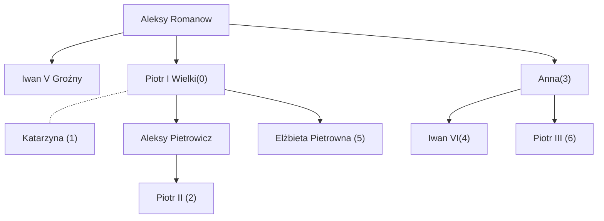

# Rosja Romanowów 
## Michaił Romanow 1613 -1645
Po wygnaniu załogi Polskiej z Kremla. [[4. Polska Renesansu 1492-1763#Zygmunt Waza 1587 - 1632#Rosja w tym czasie]]
Zebrał się sobór ziemski.
Pierwotnie carem miał być jego ojciec ale był on więźniem RP.

W trakcie panowania

#### Pokój w Dywilnie 1618
Koniec wojny z RP.
Rp uzyskała Smoleńszczyznę oraz Czernichowszczyznę.
RP zgodziła się na oddanie Michaiłowo Romanowi ojca, **Fiodora Romanowa**

#### rządy
Tak naprawdę rządził **Fiodor Romanowa**, który był mianowany na patriarchę Rosji i Wszechrusi.Rządził do 1633 .
## Aleksy Romanow 1645 -1675
W trakcie rządów: Wojny z RP o smoleńszczyznę.

Rozejm w Andruszowie
Pokój Grzymółtowskiego : [[4. Polska Renesansu 1492-1763#Jan III Sobieski 1663 - 1696#Pokój Grzymułtowskiego 6 maja 1686 (z Rosją )]]

### Synowie Aleksego Romanowa
#### Fiodor 1675 - 1681
Zasiadał na tronie 6 lat.
Po jego śmierci rozgrywa się potężny konflikt do władzy.

- Iwan (umysłowo niedorozwinięty)
- Piotr (10 lat)

Za jednym i drugim stały inne siły które chcą rządzić w ich imieniu.

#### Sobór ziemski Piotr Carem
Ogłasza że carem zostaje Piotr a regentka zostaje jego matka Natalia Nalecznikowa.

Pominięty Iwan miał swoich stronników.
M. Inn. Zofia Aleksiejewna stała za Iwanem, ale chciała sama rządzić.

#### Szemranie Zofii aby Iwan został carem
Siostra rozpłakała się na pogrzebie o miłości do swojego brata i że Iwan powinien być carem.

W pobliżu stacjonowali strzelcy carscy którym od dawna nie wpłacili żołdu.
Zofia wpłaciła im żołd + 10 rubli.

Strzelcy zgłosili prośbę do soboru żeby Iwan był carem.

KILKA TYSIĘCY STRZELCÓW.
Postanowienia Soboru: Obaj będą panować jako Carzy.

Strzelcy wystawiali prośbę aby Zofia Alieksiejewna pełniła władzę jako regentka. Realną władzę zdobyła Zofia za pomocą strzelców i bojarów.

**Zofia Rządzi przez 7 lat do 1689**

### Piotr Wielki 1689 
17-letni Piotr zawiązał sposek i obalił rządy siostry i wysłał ją do klasztoru

Imię: Piotr I Romanow

1697 - Grand Tour po Europie. Obiad krajów Rzeszy Niemieckiej, Anglii. Incognito. Poznaje nowoczesne kraje, uprzemysłowione z kapitalistyczną gospodarką.

Moje przemyślenia: musiał mieć bardzo silną władzę skoro wprowadził tak niekorzystne dla szlachty reformy.

##### Reformy obyczajowe
zakazuje bojarom nazywać się bojarami . Mieli ubierać się na wzór europejski.
Gładko ogolony.

Jedyny wyjątek to duchowni, bo nie mogą oni obcinać brody.

Palenie tytoniu, i na dworze tańczy się także na zachodzie

##### Reformy wojska
Pobór do stałej armii. Szkoła kadetów do szkolenia oficerów.
Musi też mieć flotę i artylerię.

Skutek: gwałtowne unowocześnienie armii

##### Podział administracyjny
Gubienie, prowincję i dystrykty.
Burmistrzowie w miastach.

Władca ma największą władzę.

Tabela 14 rang - urzędnicy i wojsko.
Od której rangi szlachectwo, od której dziedziczne szlachectwo, od której audiencji u Cara.

Senat rządzący - nadzorował pracę całej administracji.

Wcześniej : na urzędy była mianowana bogata szlachta
#### Rządy

Akademia nauk. 
Cerkwią zarządzana przez cara.

NOWY ALFABET: z cyrlicy zmienił na graszdankę do 1905

Kalendarz Juliański w miejsce kalendarza Bizantyjskiego 

Podatek pogłówny - płacony od człowieka.

**1721 - mianowanie się cesarzem imperatorem wszechhrusi**

#### Piotrogród
1697 - armia rosyjska zdobywa Azof
Azow - wyjście na morze czarne, ALE wyjście na Morze Śródziemne tylko przez Stambuł -> Rosja chce wyjście na wszechocean

Tym miastem miał być Piotrogród.

1712 - stolica przenosi się do Piotrogrodu, mimo że to dalej była Szwecka ziemia.

Podczas budowy S. Petersburga, aby dodać animuszu ludziom pracującym sam czasami coś kopał czy piłował drzewa. Mieszkał w prostym domu z bali.

Budowa bardzo bko postępuje : Najpierw powstaje twierdza, potem port i stocznia wojenna.
Miasto które szybko rosło - około 90% budżetu szło na Piotrogród

#### Wojna z persją
Podbił Południowe Wybrzeże morza Kaspijskiego.

#### potomstwo
13 dzieci, 8 synów, ale żaden go nie przeżył.
ACZKOLWIEK jeden jego syn, Aleksy, miał syna Piotr Aleksiejowicz

Rozkazał aby carycą została Katarzyna, jego żona 

### Elżbieta Pietrowna 1741 - 1762

Elżbieta - córka Piotra Wielkiego.
Zasiada 21 lat.

Elżbieta wprowadziła zasadę że szlachcic może wysłać niewygodnego chłopa na Syberię.

Każe wybudować legendarny pałac zimowy - główny pałac carów.

Ogłasza że jej następca będzie Piotr syn Anny

#### Piotr III Romanowy 5 sty 1762 - 9 lip 1762
Jest niemcem, księciem Holsztynu.
(Urodził się u wychował w Holsztynie).
Holsztyn - część Niemiec przy granicy z Danią

Lore:
1742 - słyszy że ma być następcą, więc w wieku 16 lat wyjeżdża do Rosji
Do końca życia mówi po rosyjsku kiepsko.

Przywozi żonę Annę Fryderykę.
Małżonkowie często się zdradzają i nienawidzą się

Po objęciu tronu, bardzo sprzyjał Niemcom.
W trakcie trwającej wtedy [[4. Polska Renesansu 1492-1763#Wojna 7-letnia 1756 -1763]] prowadził bardzo pro-niemiecką politykę, na tyle że oddał [[8b. Narody Niemieckie 1630-1910#Branderburgia#Fryderyk II Wielki 1740 - 1786]] świeżo podbite Prusy.

Jego żona robiła z siebie turbo-Rosjankę. Ludzie skupieni wokół carycy postanowili pozbyć się cara Piotra. 

### Katarzyna II Wielka 1762 - 1796
Lubiła mówić o sobie że jest Piotrem wielkim w spódnicy.
**GENDER ENVY** - imagine being a badass bitch **!**

Rządziła żelazną rolą. Część ludzi przekonała do siebie swoimi wdziękami.

Miała bardzo wielu stronników. Książę Suworow - nigdy nie przegrał żadnej bitwy jako dowódca.

Otworzyła szkołę dla dziewcząt.

Sekularyzacja : wszystkie majątki kościelne przechodzą na skarb państwa.
Chłopi (ok. 1/7 wszystkich) pracujący na rzecz kościoła uwłaszczeni.

Silna kolonizacja Syberii.

Zdobyła część ziemi Hanatu Krymskiego i po pewnym czasie po prostu przyłączyła Krym do Rosji.

Podbiła ziemię na północ od morza Czarnego. 
Większość miast  w obecnej wschodniej  Ukrainie.

#### Reformy
1767 - określiła ukazem ustrój panujący w Rosji
Wprowadziła
**To link** : absolutyzm oświecony

##### reformy administracyjnie
Podział państwa na 50 guberni, 300-400k mieszkańców. 

Za carycy Katarzyny dołączyli Alaskę do Rosji.

#### 1773 Bunt chłopski

**Powody**:
Mocniejszy ucisk chłopów. Dodatkowo niezadowoleni Kozacy.
Przewodził Pugacow - poddawał się za Cara Piotra który się uratował.
Zebrał dużo chłopów na Uralu i okolicach powołża.
3 lata chodzenia, rabowania majątków szlachty i uciekania.

**SKUTEK:** chłopi stracili wszystkie prawa jakie mieli - stali się praktycznie niewolnikami

#### Wojny z Turcją 
Dowodził feldmarszałek sukorow.

**Skutki**
Pokój w kucik-karandży. 
- Rosja przejmowała wszystkie tereny na północ od morza Czarnego
- Turcją godzi się na rosyjską żeglugę przez bosfor
Rosja staje się siłą dominującą.

Książę Potiomkin - budował na środku stepu wioski żeby pokazać zachodnim władzom że już stepy są  zagospodarowywany.
**Woski potiomkinowskie** - powiedzenie

#### Polityka z Polską
Polityka prowadząca do tego żeby Polska była protektoratem Rosyjskim.

Gdy była żoną Piotra III jeszcze nie na tronie w Petersburgu był poseł **Stanisław Poniatowski**.

Weszła z nim w romans, publicznie rozgłaszała plotki ze jej syn Paweł jest od Stanisława.

Po co? Żeby nie kwestionowano jej prawa do tronu, a gadano o jej życiu obyczajowym.

Od [[4. Polska Renesansu 1492-1763#Sejm Niemy 1717]] Polska jest pod protektoratem Wielkiego Cesarstwa Rosyjskiego. 

Przybiera to na sile gdy umiera August III a ona posądza Stanisława Augusta Poniatowskiego.
Reprezentował on [[4. Polska Renesansu 1492-1763#Podział magnacki#Familia]].
Caryca mu pomogła i został wybrany królem Polski.
1771 - wspólnie z posłem pruskim ustalono że i Prusy i Rosja zaczną "rozbiory" - Prusy dostaną prac ziemi między Prusami i Brandenburgią

1772 - pierwszy rozbiór RP.

Podbija też kawałek Gruzji, biorąc Turcję w kleszcze.

### Paweł I 1796 - 1801
Urządza swojemu ojcu, Piotrowi III, ponowny pogrzeb.

Rządzi 5 lat. Bardzo pro-niemiecka polityka.
Spisek przeciwko pawłowi, żeby jego syna, Aleksandra poradzić na celu.

#### prawo dziedziczenia
Tak bardzo nie lubił carycy Katarzyny że Wprowadził prawo że kobiety nie powinny dziedziczyć

The Law of Succession (issued by Tsar Paul I in 1797) was one of the most consequential pieces of Russian legislation, because it rewired how the throne passed from one ruler to the next.

  

Here’s the background:

Before Paul, Russian monarchs could more or less handpick their successors. Peter the Great had set that precedent in 1722, and Catherine II used it to edge out Paul himself in favor of her own rule. This created a century of intrigue, palace coups, and assassinations—basically, the Russian throne was a game of musical chairs played by ambitious nobles and guards regiments.

  

Paul wanted to stop this chaos. His law made succession strictly hereditary and male-preference:

  

1. Primogeniture established  
    – The throne would pass automatically from father to eldest son.  
    – If the emperor had no sons, it would pass to the closest male in the Romanov line.
2. Female succession only if no males left  
    – Women could inherit the throne, but only if the male line ran out completely. (This was a reaction against Catherine II, whom Paul resented for taking the throne from his father, Peter III.)

#### końcówka
Spiskowcy aresztują i grożą żeby abdykował, po niezgodzie uduszają go.

### Aleksander I  1801-1825
Podobny do Katarzyny II.
Z polskiego punktu widzenia przychylny Polakom.
Poleca reaktywować uniwersytet Wileński z polskim językiem wykładowym.
Książę czartoryski jego ministrem spraw zagranicznych

#### Wojna z Turcją 1806 -1812
Turcja przechodzi przez 3/4 sułtanów. Stambuł jest zagrożony rosyjską inwazją.
Car szybko podpisuje pokój z Mołdawią bo Napoleon gromadzi wojska. 
[[A. Mołdawia 1400-1900#Wojna Rosyjsko- Turecka 1806 -1812]]

**Kolejny skutek:**
Serbia uzyskuje autonomię w ramach państwa Tureckiego.

