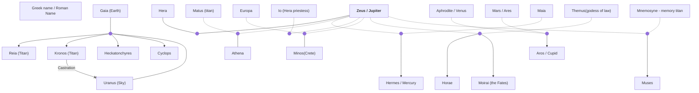

# cupid & psyches
Author: Romans - Apuleius

King & Queen have 3 daughters - youngest psyche - very beautiful, people are obsessive. She must be incarnation of Venus (Afrodyte).
They are also obsessed that she is a virgin. 
Sisters are annoyed and envious... Villagers are worshiping her

Venus is annoyed and envious, she wants to kills psyche. She sends her son Cupid (Aros) {young adult, has the powers of making people falling in love. In Greek mythology he is pretty much a creep who would make people fall in love with randoms.

She wants to make psyche fall in love with someone who is "out of her bounds". For example with someone who is exiled lol.

Psyche has no luck - none have the courage to marry her. Woman had to be married so yeah... her parents are also not patient. He consulted an oracle about what he should do. Oracle says that here daughter will marry a beast that will scare even Zeus, and she will die in the wedding.

They dress pyche in marriage and funeral clothes and lead to a mountain top. Zepher comes and Carries her off the mountain. Psyche finds herself in a mansion garden. No human in there. A voice calls out to her that this is her home. Feast that sets itself. An invisible husband. Every night sex is the only contact she has with him.

Venus has her servants "Anxiety" and "Depression " to torture her.

