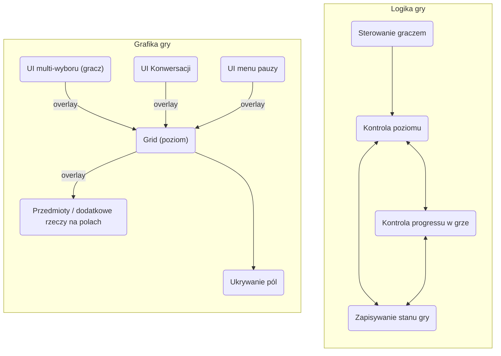

## Polecenie

Zrealizować program pozwalający graczowi na poruszanie się po opisanej tekstem mapie, walkę z przeciwnikami, podnoszenie przedmiotów etc. ("text adventure game").

Gracz powinien wydawać polecenia tekstowo (np. "idę na północ", albo "go west", czy "attack goblin", ale też "look around"). Na mapie powinny być przedmioty niezbędne do dostania się do innych obszarów świata ("klucze"), które gracz może jakoś zdobywać ("pickup key", "buy gem").

Mapa powinna być wczytywalna z pliku, gdzie możliwa byłaby pełna konfiguracja świata: * rodzaje lokalizacji z ich opisem tekstowym, * sąsiedztwo (graf) lokalizacji (co jest "na północ", czy "za mostem"), * przedmioty - ich położenie i wpływ na odblokowywanie lokalizacji, * przeciwnicy i ich siła itp.

Rodzaje poleceń obsługiwanych przez grę powinny umożliwiać w miarę "naturalną" interakcję ze światem, ale mogą (a nawet muszą - ze względu na złożoność języka naturalnego) być ograniczone do określonego zestawu komend.

Gracz powinien móc zapisać i odtworzyć stan gry.

# Zarys projektu
## Podział na moduły

# Logika gry

## Moduł poziom

#### Obiekty
#### Bez kategorii

**Postać interaktywna**
Jest to konkretny czat z AI, który pamięta wcześniejsze rozmowy.
Zmienne: preambuła - informacja o charakterze konkretnej postaci
Funkcje:
- Rozpocznij czat (możliwości) - analizuje stan gry aby wprowadzić AI do sytuacji konkretnej konwersacji. Przedstawia co może zwrócić AI (może to służyć jakimś akcjom np.)
- Zapytaj (wiadomość) - zadaje AI konkrtetne pytanie, zwraca to co AI
Przechowywane na mapie żeby jak raz został czat stworzony to żeby pamiętał historię czatów (ważne też przechowywanie w pliku)

##### Grupa 'wydarzenia'
Każde wydarzenie ma funkcję 'start', która jest synchroniczna ( wykonuje się tak długo aż wydarzenie się nie skończy ). Wydarzenie może zwracać jakieś kolejne wydarzenie (jako 'id' - nasze wydarzenia są przechowywane na jakiejś mapie). Jeśli tego nie zrobi, gracz wraca do łażenia po mapie.
Każda z nich wywoła graphics.draw.XXX odpowiednio zdefinowanej reprezentacji graficznej danego wydarzenia.

Założenie jest takie żeby projektując poziom można było zazwyczaj używać  tych pre-definiowanych wydarzeń, dziedziczenia żeby dodawać np. własne IFy itp, ale można też stworzyć własny typ wydarzenia (we własnym namespace dla każdego 'modu' gry)
Każdy też może być inicjalizowany dictem (np. lista wypowiedzi, czy lista przeciwników i ich sił), i każdy może przy inicjalizacji mieć wpisane id_next.
Każdy przedmiot posiada:
- Nazwę
- Funkcję start
- id_next (zazwyczaj predefiniowane wydarzenia je zwrócą)

***Rzeczywiste wydarzenia***
**Konwersacja**
Opis: Stała rozmowa między postaciami
Lista par (Postać, wypowiedź)

**Czat**
Opis: Interaktywna konwersacja z AI. 
AI_id (str) : Którego czatu ma użyć (bierze odpowiednią postać z mapy)

**Walka**
Opis: Starcie z przeciwnikiem. Powinno się tego unikać.
(Jak stworzę combat system to wymyślę).

**Wybór**
Wybór między predefiniowanymi opcjami. Działa też jako sposób na interakcję z polem na którym się znajdujemy - będzie odpalany po 'inspect'.

***Pomocnicze wydarzenia***
**Daj przedmiot**
Zmienne: id_przedmiotu

**If**
Ten śmieszny parser żeby nie dało się CTFować.
Sprawdza czy gracz spełnia określone warunki (np. czy ma określony przedmiot) i wywołuje odpowiednie kolejne wydarzenie (true / false). Ułatwia budowanie bloków
**Zmiana poziomu**
Każe głównej klasie gry zmienić poziom i kończy działanie.
#### Poziom - obiekty
**Vertex** - pojedyńcze pole mapy
W zależności od poziomu może różnić się metoda rysowania pola - zawiera pointer do odpowiedniej funkcji rysującej to pole.
**Zmienne**:
Lista sąsiednich wierzchołków.
Wydarzenia: wchodzenia, inspekcji, wychodzenia z pola (może być np. walka).
Czy ukryte
Dodatkowe grafiki (np. może być dodatkowy dom na polu)

**Mapa**
Zawiera listę wierzchołków, id oraz **współrzędne** każdego z nich.
Umie też z grafu (podanego jako lista sąsiectwa), wymiarów ekranu i typu poziom
Wie gdzie jest gracz.
**Funkcje**
Start() - uruchamia odpowiedni proces UI i tyle. 
#### Jak przechowywany jest poziom w pliku:
1. Default ustawienia poziomu (typ rysowania pól, wymiary, itp)
2. Mapa (id_wydarzenia : wydarzenie (z initem)) (dla budowania bloków funkcjyjnych)
3. Graf poziomu jako lista sąsiedztwa wierzchołków (id_a - id_b)
4. Dict który może niestandardowo inicjalizować wierzchołki dając im:
	 - Wydarzenia (wejście itp..) - tylko ich id
	 - Grafikę
	 - Typ rysowania
	- Wymuszać żeby były za obszarem widocznym (przydatne do przechodzenia między poziomami).
5. Dodatkowo można opcjonalnie wymusić układ pól macierzą ich id.

#### Funkcje w module
-> Wczytywanie poziomu z pliku
-> Zapisywanie poziomu do pliku
-> Zapisz / wczytaj progress w poziomie
-> start() : rysuje, uruchamia w tle odpowiednie procesy UI (czekające na input)

**Dodatkowe jak starczy czasu:**
-> Generuj losowy poziom

## Moduł gra
Funkcjonalność:
- Pamięta różne stany gry między zapisami
- Może służyć żeby definiować inne, 'zmodowane' wersje gry (pewnie takiego nie zaimplementuję)

### Obiekty
#### Przedmiot
Możliwe funkcja użycia - powinno być uniwersalne względem poziomu i dawać konkretny efekt - np. odkrycie wszystkich pól na poziomie, wyleczenie, dodatkowy damage w walce jeśli jest w niej użyty

(jest zdefiniowany jako obiekt jeśli kiedyś chcielibyśmy dodać funkcjonalność mp)
#### Gracz
Lista przedmiotów które posiada
Życie
Poziom na którym się znajduje

### Klasa główna - gra
**Zmienne**
Gracz
Lista przedmiotów
Poziom początkowy

**Funkcje**
Start() - wywoływane przez supervisor, uruchamia grę i wczytuje pierwszy poziom
change_level() - self explanatory

Wczytaj / zapisz stan z/do pliku

# Supervisor
Menu pauzy, ustawienia, zarządzanie wieloma zapisami gry.
Kiedy użytkownik uruchomi grę odpala tylko odpowiednią grę i się zamyka.

Może też być obudzony przez przycisk 'Esc' i wtedy odpowiada za menu pauzy

# Grafika 
Rysuje wszystko czego logika jest zdefiniowana

Struktura:
Na samej górze biblioteka TUI.

Każde wydarzenie które coś rysuje będzie tworzyło w odpowiednim miejscu widżet z biblioteki i umieszczało go w punkcie

Innym czymś jest grid. Jest moim custom component - ponieważ potrzebuję tam nieinteraktywnego overlayowania wielu elementów, być może z przezroczystymi polami (np. struktura na polu nie jest idealnym prostokątem)

## Grid
Custom component Urwid, który konwertuje moją metodę rysowania na jego.
Jest to główny komponent poziomu. Odpowiada za to że mając odpowiednią macierz pól zarządza gdzie które pole rysuje. 

### Element
Jest to pojedyńczy element który może być overlay'owany na grid lub inny element.

#### Obiekty dziedziczące po elemencie
##### Pole
Rysuje poszczególne pole. Może być wiele różnych funkcji dziedziczących pole : pole_miasto, pole_las, itd... każde rysuje w określony sposób teren. To co dodaje to: 
- rysowanie ścieżek do sąsiadów
- Rysowanie tak pod-elementów, żeby nie nachodziły na ścieżki jeśli nie muszą.
##### 
Może mieć 

# O co mogę pytać?
Czy muszę robić wszystko tekstowo? Ja chcę tylko niektóre rzeczy robić tekstowo (np. inspect) a chodzenie imo nie ma sensu.

Czy taki podział projektu na grupy modułów wydaje się ok?

ncurses

MVC 

Relacje między 
