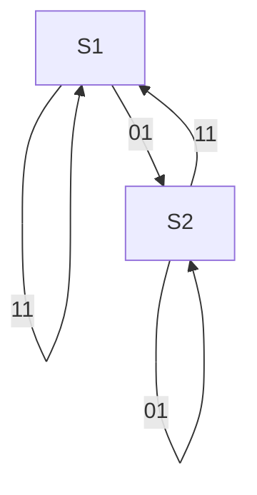
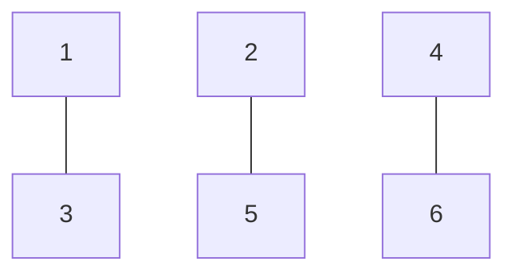
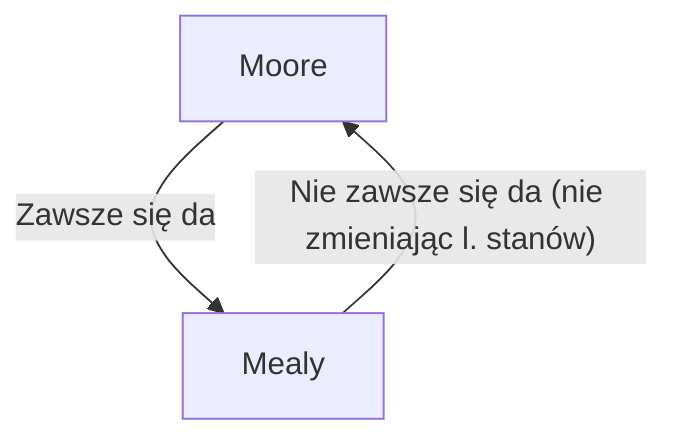
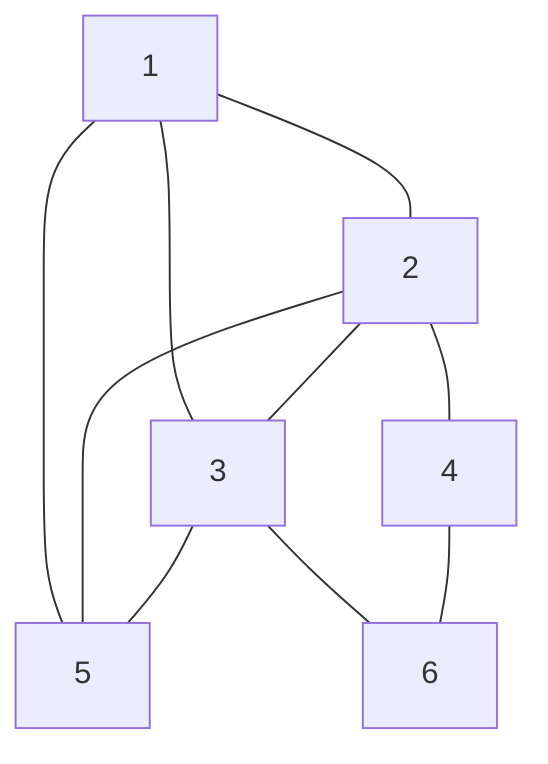

### Podział
Automaty zupełny : wszystkie przejścia i wyjścia są zdefiniowane (nie ma kresek)
Automat niezupełny: niektóre przejścia mogą być niezdefiniowane (są kreski)

### Stany równoważne

Dotyczą automatu zupełnego
Warunki:
* Wyjścia są identyczne
* Następniki sątakie same lub równoważne

| S\x1x0 | 00  | 01  | 11  | 10  |
| ------ | --- | --- | --- | --- |
| 1      | 4   | 2   | 1   | 3   |
| 2      | 4   | 1   | 2   | 3   |

Można je skracać

### Stany zgodne
Działają w automatach niezupełnych.
Można tak uzupełnić kreski żeby był stanem równoważnym.

Przyład:

| S\x1x0 | 00  | 01  | 11  | 10  |
| ------ | --- | --- | --- | --- |
| 1      | 4   | 2   | 1   | 3   |
| 2      | 4   | 1   | 2   | 3   |

Warunki:
* Stany następne są zgodne lub niesprzeczne
* Stany wyjściowe są niesprzeczne

### Minimalizacja liczby stanów
Stany zgodne i równoważne można redukować do tego samego stany

#### 1. Jak znaleźć stany równoważne?
Metoda tabeli trójkątnej - porównywanie każdego z każdym.

\<wstaw tu tabelkę\>

Żeby stany 1 i 2 były równoważne, muszą być równoważne:
Stany 4 i 5.
Stany 1 i 3
Stany 1 i 3
Stany 2 i 3

Żeby stany Stany 1 i 3 były równoważne:
Stany 4 i 6

[...]
Żeby stany 4 i 6:
Stany 1 i 3:

| 2   | 4,5;1,3;1,4;2,3; | x         | x       | x   | x   |
| --- | ---------------- | --------- | ------- | --- | --- |
| 3   | 4,6              | 5,6; 3,4  | x       | x   | x   |
| 4   | 0                | 0         | 0       | x   | x   |
| 5   | 2,4              | 1,3; 4,6; | 2,6; .. | 0   | x   |
| 6   | 0                | 0         | 0       | 1,3 | 0   |
|     | 1                | 2         | 3       | 4   | 5   |
↓↓ Eliminacja na pewno nie↓↓

| 2   | 0(1,3) | x        | x      | x   | x   |
| --- | ------ | -------- | ------ | --- | --- |
| 3   | 4,6    | 0(5,6)   | x      | x   | x   |
| 4   | 0      | 0        | 0      | x   | x   |
| 5   | 0(2,4) | 1,3; 4,6 | 0(2,6) | 0   | x   |
| 6   | 0      | 0        | 0      | 1,6 | 0   |
|     | 1      | 2        | 3      | 4   | 5   |
↓↓ Eliminacja ↓↓

| 2   | 0   | x        | x   | x   | x   |
| --- | --- | -------- | --- | --- | --- |
| 3   | 4,6 | 0        | x   | x   | x   |
| 4   | 0   | 0        | 0   | x   | x   |
| 5   | 0   | 1,3; 4,6 | 0   | 0   | x   |
| 6   | 0   | 0        | 0   | 1,6 | 0   |
|     | 1   | 2        | 3   | 4   | 5   |
##### Graf stanów zgodnych:

Łączymy te stany które znaleźliśmy że są równoważne...

Wyznaczamy funkcję fi:
$$ 
\phi = \{\{1, 3\}_A, \{4, 6\}_B, \{2, 5\}_C\}
 $$
 
 Robimy nowy automat i realizujemy go...
 
### Przekształcenie automatu Moore'a w Mealy'ego
 
Kiedy mamy jakieś wątpliwości który wyjdzie taniej zawsze warto sprawdzić który z nich będzie prostszy.

Najłatwiej jest przejść z jednego na drugi jak mamy już zminimalizowaną funkcję przejść.

### Algorytm projektowania synchronicznyc automatów
1. Opis słowny przekształcamy na graf automatu
2. Na podstawie grafu sporządź tabelę przejść i wyjść
3. Zminimalizować liczbę stanów
4. Kodowanie tabeli przejść
5. Wyznacz funkcje wzbudzeń automatu (JK? T?)
6. Wyznacz funkcje wyjść
7. Testowanie

Uwaga dot. 4. kodowania: Nie każdy sposób kodowania doprowadzi nas do tej samej postaci finalnej.
Funkcje wzbudzeń mogą być bardziej lub mniej skomplikowane dla różnych kodowań. Ale jest to bardzo skomplikowane a zysk dość iluzoryczny.
(Aczkolwiek zawsze będzie działał)

#### Przykład 2
Można zacząć od wykreślania tych które na pewno nie pasują... (np. po wyjściach)
Następnie tych którzy na pewno nie pasują po wyjściach, wspisując jeśli jednak pasują

1, 2, 3, 5 jest kliką
4, 6 jest kliką

###### Algorytmizacja?
$$ 
\phi_0 = \{\{1, 2, 3, 5\}, \{2, 4\}, \{3, 6\}, \{4, 6\}\} \\ f
$$
ale
$$
\phi_0 \neq \phi_{min}
 $$
Warunki na phi:

Sprawdzamy mniejszy:
$$ 
\phi_1 = \{\{1, 2, 3, 5\}, \{4, 6\}\}
$$
Warunki:
pokrycia OK
zamknięcia NIEOK

Sprawdzamy mniejszy:
$$ 
\phi_2 = \{\{1, 5\}, \{2, 4\}, \{3, 6\}\}
$$
Warunki:
pokrycia OK
zamknięcia OK

CEL: minimalizacja iklości "spójnych"

