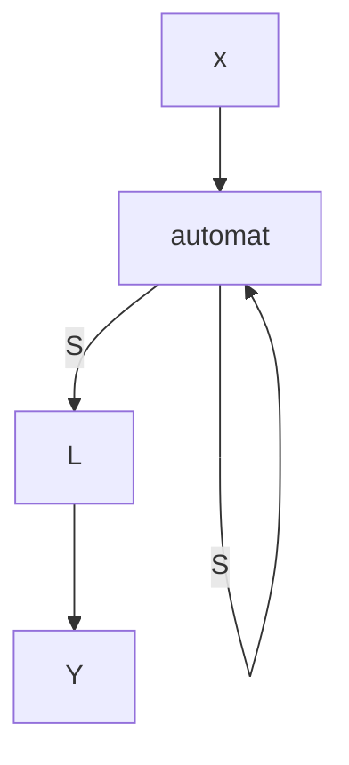
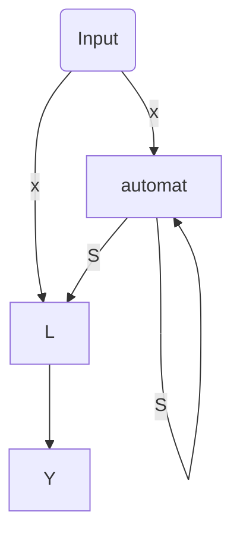
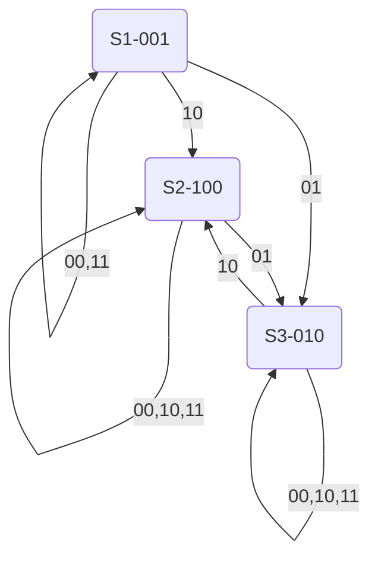

#### Wstęp

To NIE JEST układ kombinacyjny, to nie jest funkcja kombinacyjna.
Ma WEWNĘTRZNE SPRZĘŻENIE ZWROTNE

Co go wyróżnia?
Ma stan wewnętrzny

#### Tabela przejść i wyjść automatu

Si - stan automatu
x0/x1 wejścia automatu

| S\x1x0 | 00  | 01  | 11  | 10  | y1y0 |
| ------ | --- | --- | --- | --- | ---- |
| S1     | S2  | S2  | S4  | S1  | 01   |
| S2     |     |     |     |     | 10   |
| S3     |     |     |     |     | 11   |
| S4     |     |     |     |     | 11   |
|        |     |     |     |     |      |

|←-------------funkcja przejść---------→| |←funkcja wyjść→|

Tabela definiuje wszystkie możliwe przejścia z (jakiegoś stanu) do innego stanu 

Wyjście jest zależne tylko od stanu

### Zakodowana tabela wyjść
S1 ↔ 00
S2 ↔ 01
S3 ↔ 10
S4 ↔ 11

| Q1Q0\ x1\x0 | 00  | 01  | 11  | 10  | y1y0 |
| ----------- | --- | --- | --- | --- | ---- |
|             | S2  | S2  | S4  | S1  | 01   |
| S2          |     |     |     |     | 10   |
| S3          |     |     |     |     | 11   |
| S4          |     |     |     |     | 11   |

### Automaty Moor'a

S\` = d(S, X)
Y= L(S)

| S \ x1 x0 | 00  | 01  | 11  | 10  | y1y0 |
| --------- | --- | --- | --- | --- | ---- |
| S1        | S2  | S2  | S4  | S1  | 01   |
| S2        | S3  | S2  | S1  | S2  | 10   |
| S3        | S3  | S3  | S4  | S1  | 11   |
| S4        | S1  | S2  | S3  | S2  | 11   |
#### Wad
### Automaty Mealy'ego
S = d(S, X)
Y= L(S, X)

| S \ x1 x0 | 00    | 01    | 11    | 10    |
| --------- | ----- | ----- | ----- | ----- |
| S1        | S2/01 | S2/00 | S4/01 | S1/00 |
| S2        | S3/11 | S2/11 | S2/00 | S2/01 |
| S3        | S1/00 | S4/10 | S2/10 | S2/10 |
| S4        | S1/10 | S4/00 | S3/11 | S2/00 |
#### Zalety
Zazwyczaj prostsza konstrukcja bo:
bardziej zaawansowana funkcja wyjść -> prostsza konstrukcja przejść
### Równoważność automatów Moore'a i Mealy'ego

Algorytm Moore'a <-> Algorytm Mealy'ego

Robią dokładnie to samo ale inaczej (są "funkcjonalnie równoważnie)

## Przerzutniki

## Automat synchroniczny
Układy synchroniczne - układy synchronizowane układem zegarowym
Sygnał zegarowy jest doprowadzany tylko do przerzutników...

## Jak zaprojektować komparator szeregowy?
Czyli komparator sekwencyjny, czyli po kolei na jednej szynie danych pojawia się kolejny 'nit' danych.

- Bity dwóch NKB pojawiają się szeregowo na dwóch wejściach (A i B)
- Bity pojawiają się wraz z zegarem <- odczytujemy kiedy pojawia się aktywne zbocze sygnału
- Komparator ma stale pokazywać relację "<" / "=" / ">" dla odczytanych fragmentów (może być dowolnie długie, mamy podawać dla aktualnego)

##### Jakie stany i wyjścia?
3 stany (dwa bity?) i 3 wyjścia 

#### Graf automatu
Często przy bardziej skomplikowanych automatach pomaga zrozumieć jak ma działać

Wierzchołki - stany

Krawędzie 

To czego nie powiedzieliśmy to w jakiej kolejności się pojawiają - lewy bit najbardziej znaczący

| S\ab | 00  | 01  | 11  | 10  | wyj |
| ---- | --- | --- | --- | --- | --- |
| S1   | S1  | S3  | S1  | S2  | 001 |
| S2   | S2  | S3  | S2  | S2  | 100 |
| S3   | S3  | S3  | S3  | S2  | 010 |
### Kodowanie - dowolne
np. S1 ↔ 00
S2 ↔ 01
S3 ↔ 10

I wtedy bierzemy zakodowaną tablę wejść i wyjść, swapując każde Sx na 01

Kolejnym krokiem designe'u jest uporządkowanie stanów zgodnie z kodem grey'a
##### Zakodowanie tabeli wejść i wyjść 

| S\ab | 00  | 01  | 11  | 10  | wyj |
| ---- | --- | --- | --- | --- | --- |
| 00   | 00  | 10  | 00  | 01  | 001 |
| 01   | 01  | 10  | 01  | 01  | 100 |
| 11   | -   | -   | -   | -   | -   |
| 10   | 10  | 10  | 10  | 01  | 010 |

#### Wzbudzenia przerzutników D
Q1 i Q0 - swa sygnały sprzężeń zwrotnych

##### D1 - wzbudzenie przerzutnika  stanu Q1

| Q1 Q0 \ ab | 00  | 01  | 11  | 10  |
| ---------- | --- | --- | --- | --- |
| 00         | 0   | 1   | 0   | 0   |
| 01         | 0   | 1   | 0   | 0   |
| 11         | -   | -   | -   | -   |
| 10         | 1   | 1   | 1   | 0   |
###### Minimalizacja
D1 = ~q1~ab + ... 

##### D0 - wzbudzenie przerzutnika  stanu Q0

| S\ab | 00  | 01  | 11  | 10  |
| ---- | --- | --- | --- | --- |
| 00   | 0   | 0   | 0   | 1   |
| 01   | 1   | 0   | 1   | 1   |
| 11   | -   | -   | -   | -   |
| 10   | 0   | 0   | 0   | 1   |

#### Tabela wyjść komparatora
wmr

| S\ab | 00  | 01  | 11  | 10  |
| ---- | --- | --- | --- | --- |
| 00   | 0   | 0   | 0   | 1   |
| 01   | 1   | 0   | 1   | 1   |
| 11   | -   | -   | -   | -   |
| 10   | 0   | 0   | 0   | 1   |

### Wzbudzanie przerzutników T, JK, RS
Czemu? Korzystając z nich możemy uzyskać tańszy układ!

#### Step 1 - pogrumienie zmienających się pozycji

| S\ab | 00  | 01     | 11  | 10     | wmr |
| ---- | --- | ------ | --- | ------ | --- |
| 00   | 00  | **1**0 | 00  | 0**1** | 001 |
| 01   | 01  | **10** | 01  | 01     | 100 |
| 11   | -   | -      | -   | -      | -   |
| 10   | 10  | 10     | 10  | **01** | 010 |

##### Przepis przerzutnika typu T

Wszędzie tam gdzie jest pogrubienie, tam wstawiamy 1, a tam gdzie niepogrubione, 0
(czyli żeby zmienić wyjście dajemy 1)
Klasyczna minimalizacja na mapkach Kaurnagha

##### Przepis przerzutnika typu JK
Gwiazda - najczęsciej daje najbardziej optymalny układ

Dużo kresek więc dużo klatek Kaurnagh'a
	   J   K
 0->0  0   -
 0->1   1   -
 1->0   -   1
 1->1   -   0
 
JK - RS tylko gdy są 11 to ZAWSZE ZMIENIA

##### Przepis przerzutnika typu RS

	   S  R
 0->0  0   -
 0->1   1   0
 1->0   0  1
 1->1   -   0

Oczywiście można zamieniać przerzutniki - realizować przerzytnik typu X używając typu Y

Jak się za to zabrać?
Rozrysować tabelę przejść docelowego 

Da się to dość łatwo zrobić myśląc logicznie więc nie trzeba się wykuwać tylko rozumieć.
